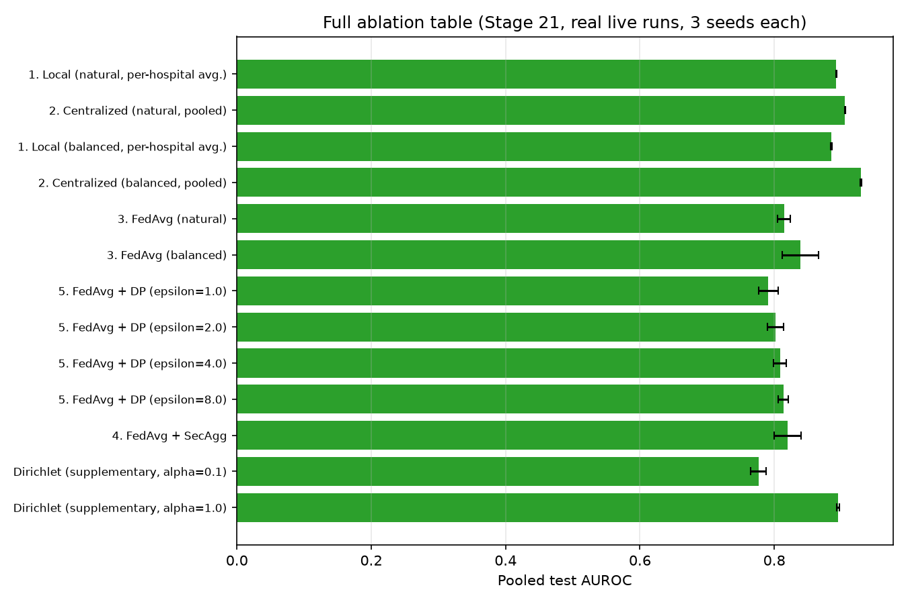

# Privacy-Preserving Medical Diagnosis using Federated Learning

Pneumonia detection from chest X-rays, trained collaboratively across multiple simulated
hospitals **without any hospital ever sharing patient images**.

Each hospital trains locally and transmits only a small, differentially-private,
cryptographically masked model update over an authenticated encrypted channel. A federated
server aggregates those updates — seeing only the sum, never any individual hospital's
contribution — and returns an improved global model. Predictions come with Grad-CAM
explanations and calibrated-confidence deferral to a clinician.

> **Academic research prototype.** Not a medical device. Not validated for clinical use.

---

## Status

**Stages 0–23 complete.** Federated pipeline (FedAvg + Differential Privacy + Secure
Aggregation + TLS/client auth), Grad-CAM explainability, Monte Carlo Dropout deferral, a
Docker Compose multi-client deployment, a real full ablation campaign, and this
documentation package are all implemented, tested, and validated against real live runs
— not mocked. 145 tests passing.

| Phase | Stages | Status |
|---|---|---|
| 0 — Foundation | 0, 1, 2 | Done |
| 1 — Data | 3–7 | Done |
| 2 — Model & baselines | 8–12 | Done |
| 3 — Federated core | 13–17 | Done |
| 4 — Clinical trust | 18, 19 | Done |
| 5 — Measurement & delivery | 20–23 | Done |

See `docs/IMPLEMENTATION_PLAN.md` for the full staged plan and `docs/SESSION_STATE.md` for
the detailed, per-stage running log.

## Results

The core deliverable is the ablation ladder — the measured cost of each privacy/security
layer. Full table, figures, and interpretation: **[`docs/results.md`](docs/results.md)**.



Headline findings: federation trails centralized training by ~9 AUROC points (natural
regime); Secure Aggregation is nearly free on accuracy; the DP epsilon sweep is cleanly
monotonic (tighter privacy costs accuracy, as expected); non-IID heterogeneity (Dirichlet
alpha) has the largest single effect of anything measured. See `docs/results.md` for the
honest read on where federation does *not* beat a single hospital training alone in this
dataset, and why.

## Documentation

| Document | Purpose |
|---|---|
| `CLAUDE.md` | **Governing source of truth** — architecture, decisions, conventions |
| `docs/IMPLEMENTATION_PLAN.md` | Project reference: overview, stack rationale, architecture, 24-stage plan |
| `docs/SESSION_STATE.md` | Detailed, per-stage development log and continuity notes |
| `docs/threat_model.md` | Threat actors, protection layers, known architectural tensions |
| `docs/results.md` | The ablation table, figures, and interpretation |
| `docs/reproducibility.md` | How every reported number traces to a config/seed/MLflow run |
| `Review_1_Privacy_Preserving_FL_Diagnosis.pptx` | Original project proposal (do not modify) |

## Architecture at a glance

```
Hospital A / B / C   ->  local X-rays never leave
     |                   CLAHE -> DenseNet121 (frozen backbone + trainable head)
     |                   -> DP-SGD -> SecAgg+ mask
     +-- TLS + client auth -->  Federated Server (FedAvg over the aggregate only)
                                        |
                          global model broadcast; round repeats
```

Four independent protection layers, each covering a different asset — see
`docs/threat_model.md` for the full write-up:

| Layer | Protects | Mechanism |
|---|---|---|
| Federated Learning | Raw patient images | Images never leave local storage |
| Differential Privacy | Information inside an update | Opacus DP-SGD, reported (epsilon, delta) |
| Secure Aggregation | One hospital's update, from the server | Flower SecAgg+ |
| TLS + client auth | Messages in transit | gRPC TLS plus client identity |

## Technology stack

Python 3.11 · PyTorch · DenseNet121 · Flower (FedAvg, SecAgg+) · Opacus · OpenCV (CLAHE) ·
torchvision · Grad-CAM · Monte Carlo Dropout · Hydra/OmegaConf · MLflow (local) ·
Docker Compose · pytest

Exact pinned versions live in the dependency file — see `CLAUDE.md` §4 for roles and
rationale.

## Repository layout

```
conf/        Hydra configs (model, data, federated, privacy, experiment)
src/         data, models, privacy, federated, explain, uncertainty, evaluation, training, utils
scripts/     dataset prep, cert generation, experiment/ablation runners, figure generation
tests/       pytest suite, 145 tests (see CLAUDE.md 11.3)
docker/      Dockerfiles + compose for the multi-client deployment demonstration
docs/        plan, session log, threat model, results, reproducibility, figures
data/        raw/processed data (gitignored); partitions + manifests are committed
```

## Getting started

```bash
scripts/setup_env.sh        # or: uv sync --all-groups
uv run pytest tests/        # 145 tests; dataset/GPU-dependent tests skip gracefully if absent
```

Requires [uv](https://docs.astral.sh/uv/) and a CUDA-capable GPU for the pinned `torch==2.13.0+cu126`
build (CPU-only machines can drop the `[tool.uv.sources]` pin in `pyproject.toml`; the
CI workflow at `.github/workflows/tests.yml` does exactly this).

Reproduce the ablation table and figures from the tracked MLflow data:

```bash
uv run python -m src.evaluation.tables               # prints the ablation table
uv run python scripts/generate_result_figures.py     # regenerates docs/figures/*.png
```

Run the multi-client deployment demonstration (real TLS, real SecAgg+, real separate
processes via Docker Compose):

```bash
scripts/run_deployment.sh
```

## Data

Kermany chest X-ray (Hospital A) and RSNA Pneumonia Detection Challenge (Hospitals B, C).
**RSNA requires a Kaggle account and acceptance of the competition rules.** No patient data
is stored in this repository; only split manifests, partition indices, and checksums are
committed (`data/partitions/*.json`, allowlisted in `.gitignore`).

## Limitations

Stated honestly rather than concealed — full list in `CLAUDE.md` §15. The headline ones:
simulated hospitals (not a real cross-institutional deployment); the frozen backbone caps
achievable accuracy relative to full fine-tuning; the DP mechanism as implemented is
effectively *local* DP, which has worse utility than central DP at equal epsilon
(`docs/threat_model.md`); malicious/Byzantine clients are out of scope; MC Dropout is a
known-weak, potentially poorly-calibrated uncertainty estimator.

## Project

B.Tech BCSE497J — Project I, SCOPE
Uddhav Sethi (23BKT0092) · Chirag Gadhyan (23BDS0265) · Ishaan S Shrivastav (23BCI0130)
Faculty guide: Dr. Adaline Suji
Aligned to UN SDG 3 — Good Health & Well-Being
