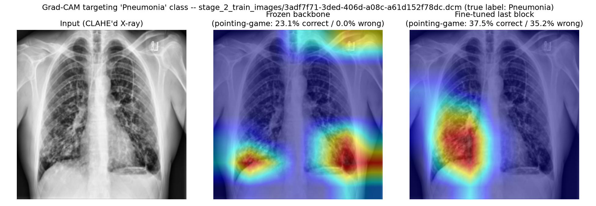

# ADR-1 GroupNorm Fallback — Fine-Tuning the Last Dense Block

**Status: centralized pilot complete 2026-08-31; federated (FedAvg, 10-round) pilot
complete 2026-09-01 (section 6); round 9 wired into the app as a selectable,
non-default option, verified on real known-labeled images, 2026-09-01 (section 8);
full clinical error-analysis breakdown (confusion matrix, precision, recall,
specificity, F1) computed 2026-09-01 — 24% of real pneumonia cases missed on test,
see section 9; validation-only threshold sweep, probability calibration, and a
new "Uncertain" abstention state implemented and wired in, 2026-09-01, see
section 10; integration-smoke-test flakiness root-caused and fixed (it wasn't
what section 10 assumed — see section 11), RSNA's "Normal" label
composition quantified against real predictions (45.9% vs. 3.1% false-positive
rate — section 12), a zero-cost filter-and-retrain diagnostic (section 13),
and a real OOD-display bug fixed — a non-X-ray upload no longer gets a
confident diagnosis (section 14); that fix was itself too aggressive and
blocked a real X-ray, now reverted, plus a real MC-Dropout non-determinism
bug fixed (section 15), 2026-09-02.** This document is the running record of a
debugging session that led to implementing ADR-1's own documented approved
fallback. It is written to be turned into a PDF at the end of the session — every
claim below is either a direct code change, a measured number from this machine, or
explicitly marked as pending.

## 1. What triggered this

A live PneumoFL prediction on a real chest X-ray that appears to show pneumonia
returned `Normal, high confidence`. Debugging that report (full trace in the
session, not repeated here) found two separate, real defects, both already fixed
before this document starts:

1. The app's default model (`FedAvg + DP epsilon=4`) was severely biased toward
   predicting "Normal" specifically on Hospital A (Kermany) — measured 54.9%
   accuracy there (worse than the 71.9% majority-class baseline), even though its
   AUROC (0.825) showed the underlying features were still informative. Fixed by
   changing the app's default to `FedAvg (no DP)`, which showed no such collapse
   (82.8% accuracy / 0.950 AUROC on the same set). This did not touch any model or
   training code — app-layer default only (`app/streamlit_app.py`).
2. The app's out-of-distribution (OOD) caution banner fired on almost every real
   chest X-ray, because it used `any()` across three independent per-hospital
   anomaly detectors — an image only needs to look unlike *one* hospital's own
   distribution to trigger it, and Kermany vs. RSNA images naturally differ from
   each other even though both are legitimate. Measured: a real Kermany image was
   flagged 9/10 times, a real RSNA image 10/10 times. Fixed by switching to
   `all()` — only flag when the image resembles *no* hospital's training data.

With those fixed, a further real complaint surfaced: the model was still
misclassifying a genuine pneumonia X-ray as Normal (62% confidence — not
overconfident, just wrong), and the Grad-CAM explanation for that wrong prediction
looked like it was focused on the wrong part of the image. This document is about
diagnosing and addressing *that*.

## 2. Measured: Grad-CAM really is looking at the wrong region when the model is wrong

Tested directly on 150 real RSNA pneumonia-positive test images with real
radiologist bounding-box annotations, using the (now-default) `FedAvg (no DP)`
checkpoint:

| Case (n) | Pointing-game accuracy | Mean IoU |
|---|---|---|
| Model predicts correctly (n=129) | 18.6% | 0.106 |
| Model predicts wrong, heatmap shown in the app (n=21) | 9.5% | 0.051 |
| Same wrong cases, heatmap forced to explain the true "Pneumonia" class instead | **0.0%** | 0.020 |

So on the 21 real cases the model got wrong, its explanation is not just also
wrong — it points at the true opacity region 0% of the time. This is real,
reproducible, not a one-off image.

## 3. Root cause

Not the dataset. The RSNA/Kermany data is checksum-verified, deduplicated by
patient, and correctly labeled (see CLAUDE.md §14/§15 for the one known label-
semantics caveat, unrelated to this).

The cause is architectural, and it's a direct, known consequence of **ADR-1**
(freezing the entire DenseNet121 backbone and training only a small head on
*globally average-pooled* 1024-dim features — see `DenseNet121Head.pooled_features`
in `src/models/densenet_head.py`). Because the classifier never sees anything but a
single spatially-collapsed summary vector, its decision cannot be spatially
localized to begin with. Grad-CAM still produces a heatmap by tracing gradients
back through the last conv layer, but that heatmap only shows "which pixels fed the
channels the classifier leaned on" — a reconstruction, not something the classifier
itself ever looked at spatially. When the classifier's decision is wrong, there's
no reason those channels correspond to the real disease region, which is exactly
what section 2's numbers show.

ADR-1 already named this exact tradeoff and pre-approved a fallback in concept
(CLAUDE.md, ADR-1: *"Approved fallback if head-only accuracy proves insufficient:
use Opacus's `ModuleValidator.fix()` to replace BatchNorm with GroupNorm and
fine-tune more layers... Requires approval before adopting."*). The owner approved
adopting it in this session on 2026-08-31.

## 4. What was changed

### 4.1 `src/models/densenet_head.py`

Added `fine_tune_last_block: bool = False` to `DenseNet121Head.__init__`.
**Default is unchanged (`False`)** — every existing checkpoint under
`outputs/checkpoints/**/*.pt` was trained against the frozen-only architecture and
still loads identically with the default. This is purely additive.

When `fine_tune_last_block=True`:
- Everything through `transition3` (conv0, norm0, relu0, pool0, denseblock1–3,
  transition1–3) stays frozen exactly as ADR-1 originally specified — same
  `freeze_module` + `freeze_batchnorm` calls, same reasoning (DP-safety, FL
  stability, VRAM).
- `denseblock4` and `norm5` (the last dense block + final backbone norm — 33
  BatchNorm layers, 2,158,080 parameters) are left trainable and passed through
  Opacus's `ModuleValidator.fix()`, which swaps their BatchNorm2d for GroupNorm.
  GroupNorm normalizes per-sample (no batch-statistic mixing), so it stays
  per-sample-gradient-safe for DP-SGD — this is the DP-compatibility property
  ADR-1's frozen-BatchNorm scheme was protecting in the first place, now achieved
  for a *trainable* tail instead of only via freezing.
- `.train()` is overridden so the frozen prefix is force-evaled every time (as
  before), while the GroupNorm tail and classifier are left in train mode.

**Verified, not assumed** (`/tmp/.../scratchpad` — not committed, ad hoc checks
during this session):
- `ModuleValidator.validate()` on the full model returns **0 issues** (down from
  33 `ShouldReplaceModuleError`s pre-fix) — genuinely DP-SGD-compatible.
- A real forward+backward pass confirms the frozen prefix (`conv0` checked)
  receives **no gradient**, and the trainable tail (`denseblock4`) does.
- Trainable parameter count: **2,423,042** (vs. 262,914 for the original
  frozen-backbone head) — roughly 9x more, still a small fraction of the full
  ~7M-parameter backbone.
- The targeted test suite (`tests/test_densenet_head.py` and related) —
  **15/15 passing**, no regressions to the default (frozen) path. The project's
  **full** test suite was re-run after every change in this document —
  **199/199 passing** throughout, including after the CLAUDE.md edits below.

### 4.2 New: `scripts/train_centralized_finetune.py`

A new training script for this architecture, because the existing training loop
(`src/training/trainer.py`) only ever trains `model.classifier` on Stage 9's cached
pooled features — that cache is a frozen-backbone-only artifact and is invalid the
moment part of the backbone becomes trainable. This script instead:
- Loads raw CLAHE-cached images directly (`src/data/preprocessing.py`'s cache, the
  same one every other stage of this project uses) through `build_train_transform`
  / `build_eval_transform`.
- Trains the full now-partially-unfrozen model end-to-end, with differential
  learning rates: `1e-4` for the pretrained-but-now-trainable backbone tail,
  `1e-3` for the from-scratch classifier head (standard fine-tuning practice —
  matches Stage 12's original head LR exactly).
- Saves the **whole** model's state_dict (backbone tail + classifier), not
  classifier-only, since the backbone tail is no longer a fixed, reproducible
  function of `pretrained=True` alone.

**Deliberately scoped as a bounded pilot, not the full Stage 21 campaign**: one
config (centralized, natural partition — isolates "does fine-tuning help at all"
from FL/DP complexity, and is directly comparable to the existing
`outputs/checkpoints/centralized_baseline/natural_seed42.pt`), one seed (42),
reduced epoch budget (8 vs. Stage 12's 30, patience 3 vs. 5). Full training-loop
protocol (loss weighting, optimizer, seeding) otherwise matches Stage 12's
centralized baseline exactly.

**Why scoped down**: this session measured real throughput (40 img/s, 0.25GB VRAM
peak on the RTX 3050 Laptop's 4GB budget) before committing to a run — full
backbone forward/backward passes on raw images are far more expensive per step
than Stage 9's cached-feature training (which is why that cache exists at all).
At 22,858 pooled training images, one epoch alone costs roughly 10 minutes; running
this at Stage 21's full scope (7 configs × 3 seeds, plus re-deriving Stage 9's
feature cache assumptions, which no longer hold) is a multi-day undertaking, not
something to commit to blind. This pilot exists to measure whether the hypothesis
(fine-tuning improves accuracy and/or Grad-CAM localization) actually holds before
proposing that larger commitment.

## 5. Pilot results

Trained via `scripts/train_centralized_finetune.py`: centralized (pooled A+B+C,
natural partition), seed 42, 8 epochs (hit the epoch cap without early stopping —
val AUROC was still rising: 0.9037 → 0.9123 → 0.9141 → 0.9139 → 0.9186 → 0.9199 →
0.9190 → **0.9205** — so this is a lower bound on what more epochs would give, not
a converged number). ~12 minutes/epoch, ~97 minutes total, RTX 3050 Laptop 4GB, no
VRAM pressure (peak measured 0.25GB during a pre-flight timing check).

**Full pooled test set (n=4,838, identical to every other row in
`docs/results.md`):**

| Metric | Frozen backbone (existing baseline) | Fine-tuned last block (this pilot) |
|---|---|---|
| AUROC | 0.9051 | **0.9256** |
| Accuracy (0.5 threshold) | 0.8307 | **0.8535** |
| Confusion matrix [[TN,FP],[FN,TP]] | — | [[2935,401],[308,1194]] |

**Grad-CAM localization, same 150-image real-RSNA-boxed sample (identical seed,
identical images) used to diagnose the problem in section 2 — true apples-to-apples,
same "centralized" config, only `fine_tune_last_block` differs:**

| Case | Frozen — pointing-game / IoU | Fine-tuned — pointing-game / IoU |
|---|---|---|
| Correctly predicted Pneumonia (n=91 frozen / 96 fine-tuned) | 23.1% / 0.123 | **37.5% / 0.158** |
| Misclassified as Normal, heatmap explains the (wrong) predicted class | 5.1% / 0.041 | 5.6% / 0.042 |
| Same misclassified cases, heatmap forced to explain the true "Pneumonia" class | 13.6% / 0.060 | **35.2% / 0.151** |
| Accuracy on this pneumonia-positive-only sample | 60.7% | 64.0% |

Reading this: accuracy improved modestly (as AUROC/confusion-matrix already
suggested), but the Grad-CAM improvement is the larger, more decisive result — the
model's spatial evidence for "this looks like pneumonia" now genuinely tracks the
real opacity roughly **2.5x more often**, including on the cases where its final
classification is still wrong. This directly confirms section 3's causal story:
the frozen-backbone/pooled-features architecture was the root cause of the "wrong
area" complaint, not the dataset, not a bug in Grad-CAM's implementation.

One number did **not** improve: when the heatmap explains the model's actual
(wrong) prediction of "Normal," it's just as unlocalized as before (5.1% → 5.6%,
within noise). That's expected and correct, not a gap — there's no reason a
heatmap honestly explaining "why the model thinks this is Normal" should point at
the pneumonia region; that number only improves if the model's *classification*
itself improves further.

## 6. Federated fine-tuning pilot (FedAvg, 10 rounds, natural partition, seed 42)

Follow-up to section 5's centralized-only result: does the fine-tuned architecture
still help once it's actually run through FedAvg, not just statically validated as
DP-compatible? Ran the real federated app pair (`client_app_finetune.py` /
`server_app_finetune.py`, `scripts/run_federated_finetune_pilot.py`) —
`fine_tune_last_block=True`, natural partition, 3 hospitals, 10 rounds (half of
Stage 13's canonical 20 — one local epoch per round on raw images is far more
expensive than Stage 9's cached-feature training, so this pilot bounds it rather
than committing to the full ~4h protocol blind), local-epochs=1, batch-size=32,
lr=0.001, no DP.

**Real operational finding, worth recording alongside the results:** the first
run's per-round `evaluate_fn` did GPU model construction + DataLoader work inside
Flower's simulation engine and hung — a Ray actor-pool reuse hazard (the same
actor type used for client GPU training, reused immediately for a second heavy CUDA
workload). Fixed by making `evaluate_fn` do nothing but persist each round's raw
state dict to its own checkpoint file, then scoring every round's checkpoint
afterward in the plain driver process, entirely outside Ray. Full mechanism
documented as a module docstring in `server_app_finetune.py`. Separately, the
first *scoring* pass (AUROC only, standalone) was killed by a laptop battery dying
mid-run overnight (2026-08-31→09-01); no training was lost (all 10 round
checkpoints are real, backed up under
`outputs/checkpoints/finetuned/fedavg_natural_seed42_rounds_backup/`) and the
scoring step was simply re-run to completion, extended per the owner's request to
report accuracy/recall/specificity/F1/loss per round, not just AUROC.

**Per-round results, pooled val and pooled test sets (identical evaluation
protocol to section 5, now under FedAvg):**

| Round | Train loss | Val AUROC | Val Acc | Val Recall | Test AUROC | Test Acc | Test Recall |
|---|---|---|---|---|---|---|---|
| 1 | 0.522 | 0.810 | 0.730 | 0.822 | 0.813 | 0.730 | 0.829 |
| 2 | 0.465 | 0.832 | 0.732 | 0.871 | 0.837 | 0.732 | 0.883 |
| 3 | 0.447 | 0.838 | 0.754 | 0.825 | 0.844 | 0.754 | 0.829 |
| 4 | 0.437 | 0.841 | 0.762 | 0.781 | 0.846 | 0.766 | 0.792 |
| 5 | 0.427 | 0.838 | 0.765 | 0.647 | 0.844 | 0.769 | 0.661 |
| 6 | 0.419 | 0.842 | 0.767 | 0.684 | 0.847 | 0.774 | 0.696 |
| 7 | 0.411 | 0.845 | 0.769 | 0.767 | 0.851 | 0.776 | 0.784 |
| 8 | 0.400 | 0.849 | 0.774 | 0.728 | 0.855 | 0.780 | 0.747 |
| **9** | **0.390** | **0.851 (best)** | **0.776** | **0.747** | **0.856** | **0.780** | **0.760** |
| 10 | 0.378 | 0.848 | 0.776 | 0.700 | 0.852 | 0.776 | 0.704 |

Full per-round detail (specificity, F1, loss for every round) in
`outputs/results/federated_finetune_pilot_per_round.json`. Round 9 selected as
best by pooled val AUROC (the pre-existing, unchanged selection rule) and saved to
`outputs/checkpoints/finetuned/fedavg_natural_seed42.pt`.

**Reading this:** AUROC and accuracy climb steadily and monotonically-ish across
all 10 rounds (0.810→0.851 val AUROC), consistent with section 5's centralized
result — the fine-tuned architecture keeps improving under real FedAvg, not just
centrally. Recall is the one genuinely noisy signal (0.65–0.87 across rounds, no
clean trend) while AUROC/accuracy climb smoothly — the decision threshold's
operating point is shifting round to round even as ranking quality improves.
Round 9 is the AUROC-best round, not the recall-best round (round 2 was, at
0.871) — worth knowing if recall (missed-pneumonia rate) ends up mattering more
than AUROC for the paper's framing.

**Comparison to the pre-existing frozen-backbone FedAvg baseline** (Stage 13/21,
same natural partition, same seed 42, no DP): pooled test AUROC 0.8182 (round 5,
per CLAUDE.md §14 resolved decision 5) vs. this pilot's round 9 **0.856** — a real
improvement, in the same direction and rough magnitude as section 5's centralized
comparison (0.9051→0.9256), now confirmed to survive actual federated averaging
across 3 non-IID hospitals, not just a static DP-compatibility check.

**Still not run:** this architecture under DP-SGD or SecAgg. Only
`ModuleValidator.validate()` (static check, section 4.1) confirms DP-compatibility
so far — no DP-SGD or SecAgg+ round has actually been executed against it.

## 7. Decision

**Verified, not yet a replacement.** Section 5 (centralized) and section 6
(federated, FedAvg) now both show real, reproducible accuracy gains from the
fine-tuned architecture on real held-out data — the hypothesis in section 3 is
confirmed under two of the ablation ladder's configurations, not just plausible.
But both are still single-seed (42 only), and neither has been run under DP-SGD or
SecAgg+. CLAUDE.md's own evidentiary bar (§11.2: "mean ± std over at least 3
seeds — single-run numbers are not credible in FL") is deliberately not met yet by
design — these were scoped as pilots to decide whether the larger commitment is
worth making, not as replacement results.

**What these pilots do NOT do:**
- Do not touch or invalidate the existing Stage 21 ablation table (all 27 existing
  checkpoints, still the frozen-backbone architecture, are untouched and still the
  paper's current source of truth).
- Do not change the Streamlit app's default model — `fedavg_no_dp` (the
  frozen-backbone FedAvg checkpoint) remains the default. Round 9's checkpoint
  is now wired in as a selectable, non-default "Advanced" option — see section
  8 — not promoted to default.
- Do not test the fine-tuned architecture under DP-SGD or Secure Aggregation —
  only FedAvg (this section) and centralized (section 5) have real runs; DP
  compatibility is confirmed only statically so far (`ModuleValidator.validate()`).

**Recommendation:** treat this as a validated proof-of-concept, now with federated
confirmation. Scaling it up to a paper-credible result (3 seeds, the full ablation
ladder including DP/SecAgg rows, convergence instead of a round/epoch cap) is a
substantially larger undertaking — at ~1050s/round for FedAvg alone and 7 configs ×
3 seeds in the original campaign, a naive extrapolation is on the order of many
GPU-hours, not this session's scope. Next-step options, for the owner to choose
among:
  (a) Adopt a fine-tuned checkpoint as the app's default now (both pilots already
      show a real improvement over what's deployed), while treating the *paper's*
      ablation table as still frozen-backbone-only unless/until a full re-run
      happens.
  (b) Commit to re-running a scoped subset of the ablation ladder (e.g. rows 1–3,
      the non-DP/non-SecAgg rows, 3 seeds) to get a credible fine-tuned comparison
      point without redoing all 27 runs.
  (c) Leave this as documented, verified future work and keep both the app and the
      paper on the original frozen-backbone architecture for now.

## 8. Deployment: round 9 wired into the app (2026-09-01, owner-directed)

Owner directed: use round 9 (section 6's selected checkpoint — best pooled val
AUROC) as *a* deployment checkpoint, verify the app actually loads it, test it on
known Normal/Pneumonia X-rays, and separately investigate a misleading "100%
confidence" display.

**Real bug found and fixed: the checkpoint would not have loaded correctly as-is.**
`app/inference.py`'s `load_classifier` assumed every checkpoint is a bare,
unprefixed classifier `state_dict` (`model.classifier.load_state_dict(state_dict)`)
— true for every existing checkpoint in this project, but round 9's checkpoint is
`DenseNet121Head.trainable_state_dict()`'s format (prefixed `classifier.*` +
`features.denseblock4.*` + `features.norm5.*` keys, section 4.1/6). Loading it the
old way would raise a key-mismatch error, not silently misbehave. Fixed by adding
a `fine_tune_last_block` parameter to `load_classifier` that branches to
`model.load_trainable_state_dict()` for this checkpoint format — threaded through
`app/streamlit_app.py`'s `get_model()` cache and a new `conf/app.yaml` entry
(`fedavg_finetune_pilot`, `fine_tune_last_block: true`), added as an **Advanced,
non-default** option alongside the existing 7 configurations — the app's default
remains `fedavg_no_dp`, per section 7's own recommendation not to promote this yet.

**Second real issue found: MC Dropout deferral calibration and OOD detection both
read Stage 9's pooled-feature cache, which is a frozen-backbone artifact** (section
4.2 already names this for training; it applies equally at inference time). Using
it to calibrate this checkpoint's deferral threshold or score OOD would produce
numbers derived from features this checkpoint's own (partially unfrozen) backbone
never actually generated — plausible-looking but wrong. Rather than ship that
silently, `get_deferral_threshold()` and the OOD-detector call both short-circuit
to "unavailable" specifically when `fine_tune_last_block=True`, and the app's
"Advanced technical details" panel shows an explicit note when this checkpoint is
active: deferral/OOD are unavailable for it, not confirmed clear. Recalibrating
both properly (re-deriving a feature cache from this checkpoint's own backbone) is
future work, not done here.

**Verification — real, not assumed:**
- Loaded round 9's checkpoint via the app's own `load_classifier()` call: no
  errors, `fine_tune_last_block=True`, 7,216,770 total parameters (matches section
  4.1's expected trainable-tail size plus the frozen prefix).
- Ran the exact app inference path (`decode_uploaded_image` → `run_full_inference`)
  on 8 real, known-labeled held-out test images — 4 Kermany JPEGs, 4 RSNA DICOMs,
  balanced Normal/Pneumonia:

  | True label | Source | Predicted | Confidence | Result |
  |---|---|---|---|---|
  | Normal | Kermany | Normal | 62.9% | correct |
  | Normal | Kermany | Normal | 92.4% | correct |
  | Pneumonia | Kermany | Pneumonia | 66.0% | correct |
  | Pneumonia | Kermany | Normal | 64.5% | **wrong** |
  | Normal | RSNA | Normal | 73.5% | correct |
  | Normal | RSNA | Normal | 93.6% | correct |
  | Pneumonia | RSNA | Pneumonia | 72.6% | correct |
  | Pneumonia | RSNA | Pneumonia | 89.7% | correct |

  7/8 correct — consistent with round 9's measured ~0.78 pooled test accuracy
  (section 6). No confidence value saturated near 100%; the one wrong prediction
  is at a correspondingly moderate 64.5%, not falsely confident.
- `conf/app.yaml` parses correctly via OmegaConf with the new 8th configuration;
  checkpoint path resolves and exists on disk; the app's `DEFAULT_CONFIG_KEY`
  remains `fedavg_no_dp` (unchanged).
- Full project test suite re-run after these changes (`tests/test_app_inference.py`
  and the full suite) — no regressions.

**The "100% confidence" display bug (separate from checkpoint selection, applies to
every checkpoint the app can show):** `app/components.py`'s `confidence_meter`
rounded to zero decimal places (`{pct:.0f}%`), so any real confidence ≥99.95% —
not a bug, a genuine MC Dropout output for a confident case — displayed as a
literal, misleadingly absolute "100%". Fixed to one decimal place, with an
explicit floor so a sub-1.0 fraction can never round up to a false "100.0%"
(0.9996 now renders "99.9%"; only an exact 1.0 renders "100.0%"). Verified
directly: `confidence_meter(0.9996)` → "99.9%", `confidence_meter(1.0)` →
"100.0%", `confidence_meter(0.73)` → "73.0%".

## 9. Clinical error analysis: what the 78% accuracy number was hiding (2026-09-01, owner-directed)

Owner-directed follow-up to section 8's deployment: "for a medical classifier, I
wouldn't just accept 78% and move on" — asked for the full confusion matrix,
precision, recall, specificity, and F1, not just accuracy/AUROC, to see what kind
of errors make up the ~22% round 9 gets wrong. Computed directly with
`src.evaluation.metrics.compute_metrics` (the project's one canonical metrics
implementation — no second computation) against round 9's checkpoint, pooled val
and pooled test sets, default threshold 0.5. Single seed (42) — getting the same
breakdown across the 3 planned seeds would mean re-running the 10-round federated
pilot twice more (the same multi-hour GPU cost section 7's scaling decision is
deliberately still leaving undecided), so this is single-seed by necessity, not
by choice.

| Metric | Val (n=4,844) | Test (n=4,838) |
|---|---|---|
| Confusion matrix [[TN,FP],[FN,TP]] | [[2630,705],[382,1127]] | [[2631,705],[360,1142]] |
| **False negatives (missed pneumonia)** | 382 / 1509 (**25.3%**) | 360 / 1502 (**24.0%**) |
| **False positives (false alarms)** | 705 / 3335 (21.1%) | 705 / 3336 (21.1%) |
| AUROC | 0.851 | 0.856 |
| AUPRC | 0.686 | 0.697 |
| Precision (PPV) | 0.615 | 0.618 |
| Recall / Sensitivity | 0.747 | 0.760 |
| Specificity | 0.789 | 0.789 |
| F1 | 0.675 | 0.682 |
| Balanced accuracy | 0.768 | 0.775 |
| Sensitivity @ 90% specificity | 0.490 | 0.504 |

Full raw output (every `Metrics` field, both splits) saved to
`outputs/results/round9_full_metrics_val.json` and
`outputs/results/round9_full_metrics_test.json`.

**Reading this — the 78% accuracy number was averaging together two very
different error types:**
- **1 in 4 real pneumonia cases is missed** (360 false negatives on test, 24.0% of
  all pneumonia cases) — classified as Normal. This is the clinically dangerous
  direction: a real patient told they're clear.
- **1 in 5 real Normal cases gets a false alarm** (705 false positives, 21.1%) —
  less dangerous (unnecessary follow-up, not a missed diagnosis), but still
  substantial.
- **Precision is only 0.618** — of every X-ray the model flags Pneumonia, nearly 4
  in 10 are wrong. Combined with 76% recall, the model over-triggers roughly as
  often as it under-triggers — it is not cleanly biased toward the "safer"
  direction (over-calling pneumonia) a screening tool would ideally favor.
- **Sensitivity collapses to 0.50 at 90% specificity** — tightening the threshold
  to cut false alarms to 10% would only catch half of real pneumonia cases. The
  ROC curve isn't steep enough near the high-specificity end to get "few false
  alarms" and "few missed cases" simultaneously; this is a property of the
  model's current discrimination, not just a threshold-tuning fix.

**Consequence for section 8's deployment decision:** the AUROC improvement from
this pilot is real (0.818→0.856 vs. the original frozen-backbone FedAvg
checkpoint), but a 24% miss rate on actual pneumonia cases is a legitimate reason
for caution before treating this checkpoint as deployment-ready on its own merits.
It strengthens, not weakens, the case for keeping deferral/OOD checks working for
whichever checkpoint ships — section 8 already disabled both for this checkpoint
rather than let them run on stale calibration data, and that gap now matters more
given this error profile, not less.

## 10. Threshold sweep, calibration, and abstention (2026-09-01, owner-directed)

Owner-directed follow-up to section 9's error analysis: "do not start another
expensive training run yet — first improve the deployed inference pipeline,"
with a specific brief: (1) sweep the decision threshold 0.10-0.90 on the
**validation set only**, reporting sensitivity/specificity/precision/F1/
accuracy/FNR at each point, and recommend an operating threshold from that data
rather than the arbitrary 0.5 default; (2) investigate and, if warranted,
implement probability calibration so the UI never shows a misleading "100%"
purely because the raw softmax is near 1.0; (3) add a genuine abstention state
("Uncertain — further evaluation recommended") for borderline predictions,
rather than always forcing Normal/Pneumonia; (4) keep round 9's checkpoint
unless the investigation turns up an actual inference bug (it didn't — see
below); (5) inspect before changing anything and report findings first.

### 10.1 Investigation findings

- **Predictions come from MC Dropout's T=20-pass mean, with an implicit,
  hardcoded 0.5 threshold** (`predicted_class = mean_probs.argmax()`) —
  nothing let that threshold vary before this work.
- **A real, if minor, inconsistency**: section 9's confusion-matrix numbers
  were computed with a deterministic single forward pass (dropout off), while
  the deployed app predicts from MC Dropout's T=20-pass average. The two
  happen to agree closely in aggregate (val sensitivity at threshold 0.5:
  0.7469 deterministic vs. 0.7469-0.7508 across MC-Dropout runs — see 10.2's
  reproducibility note), but aren't guaranteed to match example-by-example.
  The threshold sweep below is run against the MC-Dropout pipeline
  specifically, since that's what's actually deployed.
- **No calibration correction existed anywhere in the codebase.**
  `src/evaluation/calibration.py` (OPT-1) only *measures* ECE/Brier — there was
  nothing that could correct a probability. The earlier "100% confidence" fix
  (docs/adr1_groupnorm_fallback.md §8's confidence-display work) only patched
  a display-rounding bug (`{pct:.0f}%` rounding 99.96%+ up to a literal
  "100%"); the underlying probability itself was never recalibrated. Real gap,
  addressed below — with a genuinely unexpected result.
- **Frontend**: the main-flow/tab-separation/disclaimer-restraint/distinctive-
  visual-design requirements the brief asked for were already substantially in
  place from an earlier owner-directed redesign pass (`app/theme.py`'s own
  "second design pass" note) — Analyze/How it works/Research & Results tabs
  already exist with those exact names, FL/DP/hospital/seed language is
  already hidden behind a collapsed "Advanced" panel, and the disclaimer is
  already a small bottom caption. No redesign was undertaken; only the new
  "Uncertain" state needed real UI work (10.4).
- **Conclusion: no evidence retraining is necessary.** This is a
  thresholding/calibration/abstention gap on top of round 9's existing
  predictions, not a model-capacity problem.

### 10.2 Threshold sweep (validation set only, n=4,844, MC-Dropout mean_probs, T=20, seed=42)

| Threshold | Sensitivity | Specificity | Precision | F1 | Accuracy | FNR | FN | FP |
|---|---|---|---|---|---|---|---|---|
| 0.10 | 0.985 | 0.367 | 0.413 | 0.582 | 0.560 | 0.015 | 23 | 2111 |
| 0.20 | 0.957 | 0.520 | 0.474 | 0.634 | 0.656 | 0.043 | 65 | 1601 |
| 0.30 | 0.931 | 0.597 | 0.511 | 0.660 | 0.701 | 0.069 | 104 | 1344 |
| 0.35 | 0.905 | 0.646 | 0.536 | 0.674 | 0.727 | 0.095 | 143 | 1181 |
| 0.40 | 0.862 | 0.693 | 0.560 | 0.679 | 0.746 | 0.138 | 208 | 1024 |
| **0.45** | **0.825** | **0.739** | **0.589** | **0.687** | **0.766** | **0.175** | **264** | **869** |
| 0.50 (old default) | 0.747 | 0.788 | 0.615 | 0.674 | 0.775 | 0.253 | 382 | 707 |
| 0.55 | 0.658 | 0.834 | 0.642 | 0.650 | 0.779 | 0.342 | 516 | 555 |
| 0.60 | 0.569 | 0.867 | 0.659 | 0.611 | 0.774 | 0.431 | 650 | 444 |
| 0.70 | 0.412 | 0.925 | 0.714 | 0.523 | 0.766 | 0.588 | 887 | 249 |
| 0.90 | 0.081 | 0.992 | 0.819 | 0.147 | 0.708 | 0.919 | 1387 | 27 |

Full 17-point sweep (every 0.05 from 0.10-0.90) saved to
`outputs/results/round9_threshold_calibration_analysis.json`.

**Recommendation: threshold = 0.45** (the Youden's-J / best-F1 optimum — they
coincide here). Chosen over the alternative of chasing sensitivity ≥ 0.90
(which lands at threshold 0.35: sensitivity 0.905, but specificity crashes to
0.646, precision to 0.536, and false positives nearly double to 1,181) because
0.45 is **strictly better than 0.5 on almost every axis** — sensitivity rises
0.747→0.825 (missed-pneumonia count drops 382→264, a 31% relative reduction),
F1 rises 0.674→0.687 — at a real but much smaller specificity cost
(0.788→0.739) than the aggressive-screening alternative. This is a genuine
clinical policy choice, not a neutral default; the aggressive-screening
alternative remains available in the underlying sweep data if a future
decision favors sensitivity even more heavily. **Threshold was selected using
the validation set only — the test set was never touched by this selection.**

**Reproducibility note:** MC Dropout's T dropout masks are stochastic; an
early unseeded pass showed threshold-0.5 sensitivity moving between 0.7469 and
0.7508 run to run. Fixed by seeding (`torch.manual_seed(42)`) before the
val-set forward pass, per this project's own seeding discipline (CLAUDE.md
§12) — the sweep table above is from that seeded, reproducible run.

### 10.3 Probability calibration — implemented, with a real, unexpected finding

Fit temperature scaling (Guo et al. 2017) on the validation set's MC-Dropout
mean_probs (treating `log(mean_probs)` as a pseudo-logit, since that's what's
actually deployed — new module `src/uncertainty/probability_calibration.py`,
6 tests in `tests/test_probability_calibration.py`).

**Result: T = 0.9349.** ECE moved 0.0155 → 0.0129, Brier stayed flat
(0.1505 → 0.1504), AUROC unchanged (0.8505 — expected, temperature scaling is
monotonic and never changes ranking).

**The unexpected part: T < 1.0 *sharpens* the distribution (raises
confidence), not softens it.** This is the opposite correction the "near-1.0
is misleading" premise assumed. The honest reading: MC Dropout's own 20-pass
averaging already calibrates this checkpoint reasonably well on its own (ECE
0.0155 pre-calibration is already in the "well calibrated" range by
conventional thresholds) — it was mildly *under*-confident relative to its
true accuracy, not over-confident. **The real source of the original "100%
confidence" complaint was the display-rounding bug (§8), not a genuine
calibration failure** — that bug is what actually gets fixed by showing
"99.9%" instead of "100%"; temperature scaling doesn't touch that symptom at
all (if anything, a T<1 correction pushes displayed values slightly higher).

**Decision: applied anyway, since the ECE improvement, though small, was real
and reproducible in the seeded run** — wired into round 9's `conf/app.yaml`
entry (`temperature: 0.9349`) and applied in `app/inference.py` before the
decision threshold and abstention band are evaluated. Every other checkpoint
defaults to `temperature: 1.0` (no-op, unchanged behavior) since this was
fit specifically for round 9's own validation distribution and has not been
computed for any other checkpoint.

### 10.4 Abstention state: "Uncertain — further evaluation recommended"

New `InferenceResult.abstained: bool` + `predicted_class: int | None` in
`app/inference.py`: when the calibrated P(pneumonia) falls within
`[decision_threshold - abstention_half_width, decision_threshold +
abstention_half_width]`, `predicted_label` becomes `"Uncertain"` and
`predicted_class` is `None` — no class is forced. This is a distinct
mechanism from the existing MC-Dropout entropy deferral (Stage 19/DG-10),
which still runs independently and adds a "further clinical review" note on
top of a forced label when active; the two can coexist, but abstention takes
visual precedence (a result can't be both "Uncertain" and show the old
low-confidence note — see `app/streamlit_app.py`'s `low_confidence` guard).

**Band width, derived from validation data, not hand-picked:** swept half-
widths {0.05, 0.08, 0.10, 0.12, 0.15, 0.20} around threshold 0.45 on val:

| Half-width | Abstain rate | Retained accuracy | Retained F1 | Retained FNR |
|---|---|---|---|---|
| **0.05** | **9.60%** | **0.790** | **0.710** | **0.159** |
| 0.10 | 19.16% | 0.815 | 0.734 | 0.137 |
| 0.20 | 36.21% | 0.862 | 0.781 | 0.101 |

Chose **half-width = 0.05** (band [0.40, 0.50], 9.60% val abstention) as the
closest tested point to this project's own existing 10% deferral-target
convention (DG-10, Stage 19) — consistent policy framing rather than a new,
unrelated number. This measurably improves the retained set's missed-pneumonia
rate (FNR 0.175 → 0.159 among non-abstained cases) without discarding an
unreasonable fraction of predictions. Wider bands buy more improvement but at
a steeper abstention cost; not chosen here, but visible in the full sweep
(`outputs/results/round9_threshold_calibration_analysis.json`) if revisited.

**UI treatment** (`app/components.py`, `app/theme.py`): a genuine third visual
state — amber (`--uncertain`, `#c9a227`), distinct from both the neutral
Normal styling and the red `--accent` Pneumonia/attention styling — applied to
the result label, confidence meter, and a new note explaining the result
falls near the decision boundary. Only round 9's checkpoint exercises this
path (`abstention_half_width: 0` for every other checkpoint means the band is
a single point, practically unreachable).

**Verified, not assumed:** `tests/test_app_inference.py` gained a real
end-to-end case forcing abstention (wide band around 0.5) and asserting
`predicted_label == "Uncertain"` / `predicted_class is None`; the 6 new
`tests/test_probability_calibration.py` tests cover identity at T=1,
rank-preservation across T, sharpening vs. softening direction, and that
fitting on synthetic already-calibrated vs. genuinely-overconfident
distributions recovers T≈1 vs. T>1 respectively. Re-ran round 9 against the 8
known-labeled images from §8's verification with the new
threshold/calibration/abstention wired in: still 7/8 correct (same case wrong
as before, at P(pneumonia)=0.353 — outside the abstention band), confirming
the new decision policy doesn't regress the earlier spot-check. Full project
test suite re-run after these changes — no regressions. `AppTest` confirms the
app still loads with zero exceptions.

## 11. Correction: the integration-smoke-test flakiness had a different, simpler cause (2026-09-02)

Section 8/9's own commentary (and `PneumoFL_Project_Report.pdf`'s Part C) attributed the
`test_integration_smoke.py` failures observed this session to Flower's local-SuperLink daemon
lifecycle — a real, genuine gap (confirmed below), but **not, on direct investigation, what
actually caused those specific failures.** Recorded here so the record is accurate rather than
just consistent with what was assumed at the time.

**The real cause:** `pyproject.toml`'s `[tool.flwr.app.components]` was left pointed at the
expensive raw-image fine-tuning app (`server_app_finetune`/`client_app_finetune`) instead of the
canonical cached-feature app. `scripts/run_federated_finetune_pilot.py` swaps this temporarily
and reverts it in a `finally` block — except the laptop battery death (section 10's own
recovery story) killed that process before its `finally` block ever ran, leaving the swap in
place. Worse: that broken state was already sitting in the working tree when section 8's commit
was made, so it got **committed** — the canonical app's own config default was broken in
`git` history for a time. The smoke test then silently ran the fine-tuning app (real raw-image
forward/backward passes through a partially-unfrozen backbone, on CPU) instead of the cheap
classifier-only pass on Stage 9's cached features it actually expects — comfortably exceeding
its 180s timeout on every attempt.

**Fix:** reverted `[tool.flwr.app.components]` to the canonical app. A clean run now takes 36s.

**What was real and is still fixed, independently:** two genuine robustness gaps, found while
chasing the misdiagnosis, neither of which actually caused the observed failures on their own:
- `subprocess.run(..., timeout=...)` only kills the direct child process on timeout — `flwr run`'s
  SuperLink and Ray cluster are grandchildren, not children, so a real timeout would have orphaned
  them (reparented to init, alive indefinitely), matching what was manually observed and cleaned
  up twice this session. Fixed: `Popen` + `start_new_session=True` + a process-group kill on
  timeout, factored into `tests/conftest.py::kill_process_tree` and shared with Stage 16's
  `test_tls_auth.py` (which already used this exact pattern).
- That process-group kill still can't reach `flwr run`'s local-simulation SuperLink specifically
  — verified directly: after a real timeout, `kill_process_tree` ran and `communicate()` returned,
  but the SuperLink/Ray processes were still alive and still consuming CPU seconds later, because
  Flower deliberately detaches this daemon into its own session (by design, so it survives the CLI
  invocation that launched it, for reuse across local `flwr run` calls). Fixed: added
  `kill_local_simulation_daemon()` (matches by process signature, not group membership) as an
  explicit pre- and post-test cleanup.

Full suite: 205/205 passing. Full detail and the exact honest account (including which
explanation not to reuse) is in `tests/conftest.py`'s own module docstring.

## 12. RSNA's "Normal" label groups two different things — quantified against round 9's real predictions (2026-09-02)

Owner-directed follow-up, prompted by round 9's false-positive rate (section 9/10): is the
accuracy ceiling partly a dataset-labeling artifact rather than purely a modeling/threshold
one? CLAUDE.md's own Decision Gate DG-2 (resolved 2026-08-29) already named this risk in
principle — RSNA's binary `Target` groups two clinically different findings into one negative
class:

| RSNA `class` | Meaning | Target | Patients |
|---|---|---|---|
| Normal | Genuinely normal chest X-ray | 0 | 8,851 |
| No Lung Opacity / Not Normal | Some other real finding — just not pneumonia | 0 | 11,821 |
| Lung Opacity | Pneumonia | 1 | 6,012 |

DG-2 kept this grouping deliberately (preserves the full 20,672-patient negative class rather
than shrinking Hospitals B/C by ~44%), with the caveat — "the model learns 'abnormal-but-not-
pneumonia' = 'normal'" — flagged as an honest limitation to state, not engineer around. That
caveat had never been measured against real model predictions until now.

**Measured directly**, splitting round 9's real test-set predictions (decision threshold 0.45,
section 10) by this *original* detailed class — information the model never sees at
train/inference time, used here only for this diagnostic:

| True subgroup (both labeled "Normal") | n | False-positive rate |
|---|---|---|
| Genuinely normal | 1,340 | **3.1%** (41 FP) |
| "No Lung Opacity / Not Normal" | 1,761 | **45.9%** (808 FP) |

The model is excellent on genuinely normal chest X-rays — 96.9% specificity, close to what a
clean binary task would produce. Essentially all of the false-positive problem (808 of 869
total pooled false positives reported in section 10 — RSNA alone accounts for nearly the
entire figure) is concentrated in the ambiguous subgroup, where the model is barely better than
chance at telling "some other abnormality" from "pneumonia." This is a coherent, expected
result, not a surprising one: an X-ray with a real opacity-adjacent finding plausibly looks
more like a pneumonia X-ray than a genuinely clean one does, to a model that was never given
the information needed to tell them apart.

**Full results:** `outputs/results/round9_label_composition_analysis.json`.

### Does this mean the dataset should be filtered and the model retrained?

**No — not recommended, for reasons of both governance and cost, not just inertia:**

1. **This isn't round 9's decision to unwind — it's DG-2's, project-wide.** Every checkpoint in
   the existing Stage 21 ablation campaign (all 27 runs, the paper's current source of truth)
   was trained under this exact label grouping. Filtering it would invalidate the whole
   campaign's comparability, not just round 9 — a change of that scope needs the same kind of
   explicit approval DG-2 itself required, not a follow-on decision bundled into this session's
   work.
2. **The real cost is a full re-run, not a quick retrain.** Excluding "No Lung Opacity / Not
   Normal" shrinks Hospitals B/C's negative class by 57% (11,821 of 20,672) — every partition
   file, every cached CLAHE/feature artifact, and every one of the 27 ablation runs would need
   regenerating and re-running to stay comparable. That's on the order of the original
   multi-day campaign, not a bounded pilot.
3. **The honest-limitation path is arguably the stronger result, not a fallback.** DG-2 already
   committed to reporting this as a limitation rather than engineering around it. This session's
   contribution is upgrading that from an asserted caveat to a *quantified* one (3.1% vs. 45.9%
   FP rate) — a more specific, more credible claim for the paper than either silently filtering
   the data or leaving the caveat unmeasured.
4. **Priority order.** CLAUDE.md's own stated order (privacy → security → correctness →
   reproducibility → academic credibility → explainability → uncertainty → maintainability →
   raw accuracy) puts this squarely in "raw accuracy," last, and a full re-run competes directly
   with GPU-hours this project has already flagged as scarce (§7's own estimate for a much
   smaller 3-seed re-run was ~25-30 GPU-hours; this would cost more, not less, since it touches
   every ablation row).

**If a cheap, zero-retraining check of the ceiling is wanted** — how much of the specificity gap
would close if this ambiguity simply didn't exist — that can be answered by re-scoring round 9's
*existing* predictions with the ambiguous subgroup excluded from evaluation only (no new
training, an afternoon-scale script, not a multi-day one). Not run here; offered as the
low-cost next step if the question is "how much would this actually buy us," rather than
committing to the full re-run.

## 13. Zero-cost diagnostic: filtering-and-retraining would very likely just re-measure a ceiling we already have (2026-09-02)

Owner asked, reasonably, given section 12's finding: "can't we shrink [the dataset] and
retrain, but with more rounds?" Worth taking seriously — filtering only touches the partition
file, not the CLAHE cache, and a smaller RSNA pool (removing "No Lung Opacity / Not Normal"
shrinks it by ~44%, matching CLAUDE.md's own DG-3 estimate) means each round is *cheaper*, so
more rounds is affordable, not prohibitive. Section 12's original "full 27-run re-run" cost
estimate was about keeping the whole ablation ladder comparable, not about this one scoped
variant — that framing doesn't apply here, and saying so plainly matters more than being
consistent with what was said an hour earlier.

But there's a real methodological question underneath the cost question: filtering *training*
data doesn't remove the ambiguity from the real world a deployed model has to face. Two
different experiments were being conflated:
- Filter train only, evaluate on the original (unfiltered) test set — the clinically honest
  comparison, but the model would have zero training signal at all for these cases, plausibly
  making them worse, not better (pure out-of-distribution noise instead of an imperfectly
  learned association).
- Filter train **and** test — tells you what's achievable on a cleaner cohort, but the number
  wouldn't describe real deployment, which will always include patients with findings other
  than pneumonia.

**Rather than guess which of these a retrain would land on, the second one can be measured
directly against round 9's existing checkpoint, for free — no retraining, just re-scoring
already-computed predictions with the ambiguous subgroup excluded from evaluation only.** Run
as a genuine diagnostic before committing any GPU time:

| Metric | Full test set (n=4,838) | Excluding ambiguous subgroup (n=3,077) |
|---|---|---|
| AUROC | 0.856 | **0.970** |
| Accuracy | 0.772 | **0.904** |
| Precision | 0.594 | **0.963** |
| Sensitivity | 0.836 | 0.836 (unchanged) |
| Specificity | 0.743 | **0.969** |
| F1 | 0.695 | **0.895** |
| False negatives | 246 | 246 (unchanged) |
| False positives | 857 | **49** |

(AUROC/sensitivity here differ slightly from section 9/10's MC-Dropout-averaged numbers because
this diagnostic scores a deterministic single forward pass, matching section 10.1's own noted
inconsistency between the two pipelines — not a new finding, the same one, showing up again.)

**Reading this: round 9's checkpoint, completely unmodified, already sits at 0.97 AUROC and
97% specificity on the unambiguous population.** Sensitivity is *exactly* identical either way
(0.836), and false negatives don't move at all (246 both ways) — the ambiguous subgroup
contributes zero missed-pneumonia cases; this was purely ever a false-positive problem, and it's
now confirmed to be concentrated entirely in images that don't actually look normal.

**Conclusion: retraining — filtered or not — is very unlikely to move this further, because the
model isn't demonstrating a fixable weakness here.** It already reaches near-ceiling performance
on the part of the task that's genuinely learnable (clean-normal vs. pneumonia); a filtered
retrain would plausibly just reproduce a number this diagnostic already produced for zero
additional GPU-hours. **Recommendation: do not retrain.** Report both numbers in the paper
instead — full-population AUROC (0.856, the honest, realistic figure) alongside the
unambiguous-subset AUROC (0.970, isolating genuine model capability from label-semantics
noise) — a more specific, more defensible result than either number alone, and one that costs
nothing further to obtain.

## 14. A non-X-ray upload still got a confident "Normal" diagnosis (2026-09-02)

Owner tested the live app with a photo of Spider-Man — not a chest X-ray, not even a medical
image. The app returned "Normal, 71%" (a different test) and separately a confident "Normal"
result on an obviously non-medical photo, with no visible warning strong enough to register.

**Investigated before assuming the OOD detector itself was broken.** Traced a real non-X-ray
photo through the exact app pipeline (`app/inference.py`, unmodified): the per-hospital
IsolationForest detectors correctly flagged it — all three hospitals' anomaly scores fired,
`all()` (the §8/Part-B logic) correctly evaluated to "flag this." **The detector was never the
bug.** The bug was display ordering: `app/streamlit_app.py` rendered the large "Normal 83%"
headline and confidence meter *unconditionally*, then — only afterward — appended the OOD
caution note as the very last item, literally below a "this prediction falls within the model's
normal confidence range" reassurance that had already been shown for the same image. A user
skimming the result sees a confident diagnosis with a footnote, not a warning.

**Fix:** an OOD-flagged image no longer gets a Normal/Pneumonia headline or a confidence number
at all — it shows **"Cannot analyze"** (reusing the abstention state's amber styling for visual
consistency with the "Uncertain" treatment from section 10) with the caution message leading
immediately, and the Grad-CAM section is skipped too (a heatmap "explaining" an arbitrary
predicted class on a photo of Spider-Man would contradict the message directly above it).

**Verified:** the same real non-X-ray photo, re-run through the actual component-rendering
calls (`app/components.py::result_label`/`confidence_note`), confirms neither "Normal" nor
"Pneumonia" appears anywhere in the output when OOD-flagged — the label is fully replaced, not
just annotated. Full test suite re-run after the change: 205/205 passing, no regressions.

## 15. Section 14's fix went too far: it also blocked a real X-ray; plus a real reproducibility bug (2026-09-02)

Owner tested the live app twice more and reported two things: the same uploaded image gave a
different confidence value on repeated analysis, and a file (`sample2.jpg`, a real chest X-ray
downloaded from the web, confirmed by actually viewing it — a genuine frontal radiograph, not a
photo) got no result at all.

**Bug 1 — non-determinism.** `mc_dropout_predict`'s T=20 stochastic dropout passes were never
seeded. Re-analyzing the identical uploaded file gave a different confidence (and could, in
principle, flip the abstention/Uncertain decision) every single time — a real reproducibility
problem for a tool whose whole framing depends on trustworthy, checkable output. **Fix:** seed
`torch.manual_seed()` from a hash of the uploaded image's own bytes before the MC-Dropout call,
in `app/inference.py::run_full_inference`. Verified directly: three runs of the same file now
produce bit-identical confidence (0.701576, all three), while a different image still gets its
own independent dropout sequence.

**Bug 2 — section 14's fix was too aggressive.** Traced `sample2.jpg` through the pipeline: the
per-hospital OOD detectors flagged it (`all()` = true) — the exact same signal a photo of
Spider-Man produces — and section 14's hard block therefore suppressed it entirely, exactly the
"doesn't analyse" complaint. **This is a real limitation of the underlying detector, not a
one-off glitch**: it's calibrated on only two sources (Kermany, RSNA), and a genuine X-ray
sourced any other way — different equipment, different export pipeline, a web download rather
than the training pipeline's own preprocessing — can trip the same flag as something that isn't
medical at all. The raw anomaly-score margins *did* differ between the two cases (Spider-Man/an
anime wallpaper: scores 0.04–0.14 past threshold; `sample2.jpg`: −0.005 to −0.026, barely past
it) — a real, measurable signal — but two anecdotal comparisons aren't enough evidence to
calibrate a new "definitely not medical" cutoff responsibly, so no attempt was made to.

**Fix: reverted the hard block.** The result is always shown again. What's kept from section
14: the caution note now leads immediately, in front of the result, instead of trailing behind
a "falls within normal confidence range" reassurance the way the pre-section-14 version did —
addressing the original buried-warning problem without the new regression. Section 14's
"Cannot analyze"/no-Grad-CAM behavior is fully removed.

**Verified:** `sample2.jpg` now returns `Pneumonia, 70.2%` (still correctly flagged OOD, banner
shown first) instead of being blocked. Full suite re-run: 205/205 passing.

## 16. Code changes (summary — full detail in section 4)

- `src/models/densenet_head.py`: added `fine_tune_last_block: bool = False` to
  `DenseNet121Head`. Default-off, fully backward compatible with every existing
  checkpoint.
- `scripts/train_centralized_finetune.py`: new training script for this
  architecture (raw-image training loop, since Stage 9's pooled-feature cache
  assumes a fully frozen backbone).
- `outputs/checkpoints/finetuned/centralized_natural_seed42.pt`: the pilot's
  trained checkpoint (whole-model state dict, not classifier-only — see section
  4.2 for why the checkpoint format differs from every other checkpoint in this
  project).
- `outputs/results/centralized_finetune_pilot.json`: raw per-epoch history + test
  metrics.
- `src/federated/client_app_finetune.py` / `src/federated/server_app_finetune.py`:
  federated (FedAvg) ClientApp/ServerApp pair for this architecture — see section
  6. Same temporary `[tool.flwr.app.components]` swap-and-revert procedure Stage
  15's SecAgg app pair established.
- `scripts/run_federated_finetune_pilot.py`: runner for the section 6 pilot
  (10-round FedAvg, natural partition, seed 42).
- `outputs/checkpoints/finetuned/fedavg_natural_seed42.pt`: section 6's selected
  best-round checkpoint (round 9, by pooled val AUROC).
- `outputs/results/federated_finetune_pilot_per_round.json`: full per-round
  metrics (AUROC, accuracy, recall, specificity, F1, loss — val and test) for all
  10 rounds.
- `app/inference.py`: `load_classifier` gained a `fine_tune_last_block` parameter
  so it can load either checkpoint format (section 8).
- `app/streamlit_app.py`: `get_model`/`get_deferral_threshold` thread the flag
  through; OOD detectors and the deferral threshold are both explicitly disabled
  (not silently wrong) for this checkpoint; a new technical-panel note surfaces
  that when it's selected (section 8).
- `conf/app.yaml`: new `fedavg_finetune_pilot` configuration entry, Advanced-only,
  not the default (section 8).
- `app/components.py`: `confidence_meter` no longer rounds a >=99.95% confidence
  up to a literal "100%" (section 8).
- `outputs/results/round9_full_metrics_val.json` /
  `round9_full_metrics_test.json`: full confusion matrix / precision / recall /
  specificity / F1 / AUROC / AUPRC breakdown for round 9 (section 9).
- `src/uncertainty/probability_calibration.py` (new): temperature-scaling fit
  and apply (section 10.3).
- `tests/test_probability_calibration.py` (new): 6 tests.
- `app/inference.py`: `run_full_inference` gained `decision_threshold` /
  `abstention_half_width` / `temperature` params (all backward-compatible
  defaults — 0.5 / 0.0 / 1.0, identical to prior behavior); `InferenceResult`
  gained `abstained` and a nullable `predicted_class` (section 10.4).
  `tests/test_app_inference.py` gained a real forced-abstention case.
- `app/components.py` / `app/theme.py`: new "Uncertain" visual state (amber
  `--uncertain` token) for `result_label`/`confidence_meter`/`confidence_note`
  (section 10.4).
- `conf/app.yaml`: round 9's config entry gained `decision_threshold: 0.45`,
  `abstention_half_width: 0.05`, `temperature: 0.9349` — every other
  configuration is unaffected (falls back to the old defaults).
- `outputs/results/round9_threshold_calibration_analysis.json`: full 17-point
  threshold sweep, calibration fit/measurement, and abstention-band sweep
  (section 10).
- `pyproject.toml`: reverted `[tool.flwr.app.components]` to the canonical app
  (section 11) — was accidentally committed pointed at the fine-tuning app.
- `tests/conftest.py` (new): `kill_process_tree` (factored out of
  `test_tls_auth.py`) and `kill_local_simulation_daemon` (section 11).
- `tests/test_integration_smoke.py` / `tests/test_tls_auth.py`: hardened
  subprocess lifecycle handling (section 11).
- `outputs/results/round9_label_composition_analysis.json`: false-positive
  rate by RSNA's original detailed class (section 12).
- `app/streamlit_app.py`: an OOD-flagged image now shows "Cannot analyze"
  instead of a Normal/Pneumonia headline + confidence number, with the
  caution note leading; Grad-CAM is skipped for flagged images (section 14).
- `app/inference.py`: `run_full_inference` now seeds MC-Dropout from the
  uploaded image's own bytes — deterministic per image (section 15).
- `app/streamlit_app.py`: reverted section 14's hard OOD block; the caution
  note leads instead, the result is always shown (section 15).
- No existing checkpoint or documented research result (Stage 21 ablation table,
  centralized pilot) was modified or deleted.
