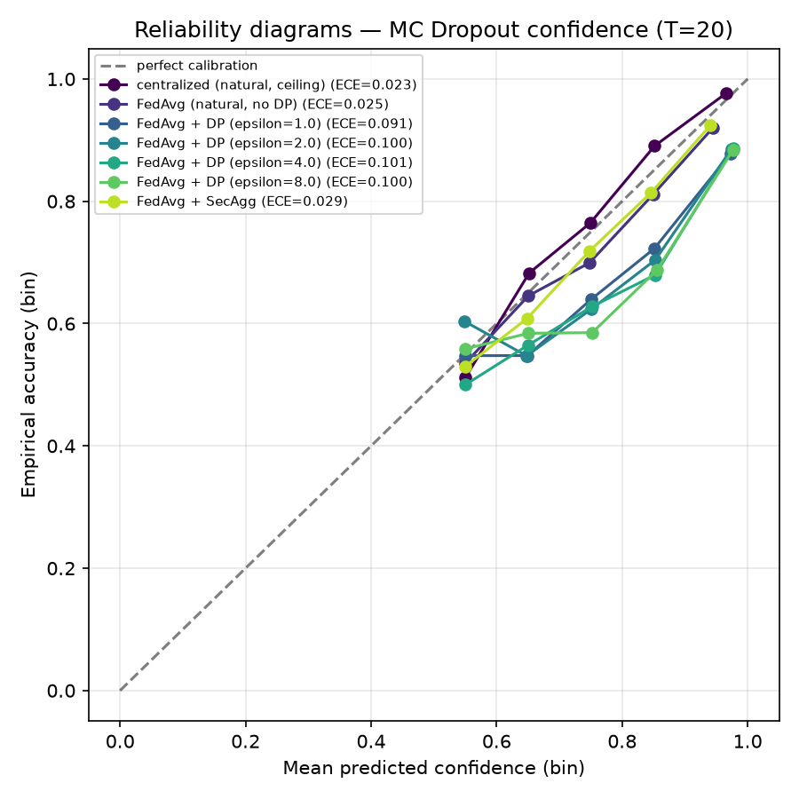
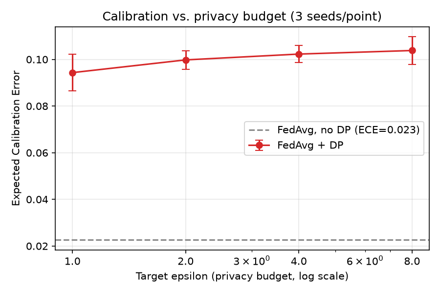
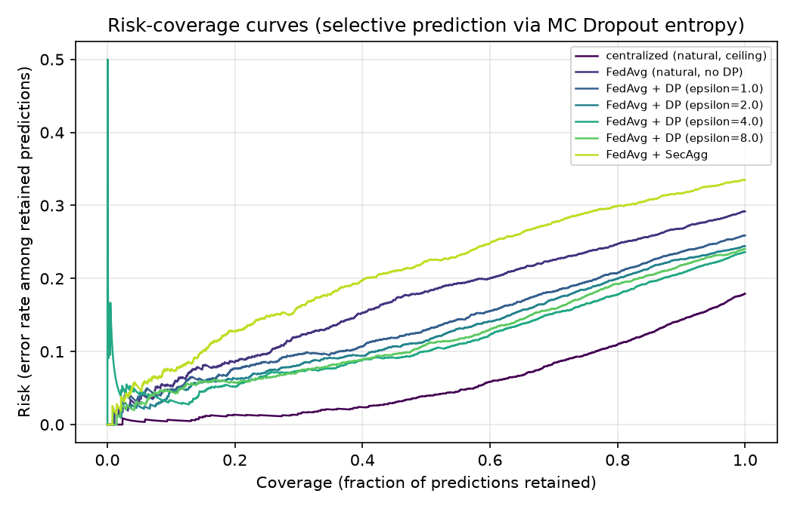

# Calibration (OPT-1)

CLAUDE.md §10 names an honest, previously unvalidated gap: "MC Dropout is a
known-weak uncertainty estimator and is often poorly calibrated." This document
measures it, rather than continuing to assert it. Every number below comes from a
real post-hoc analysis over Stage 21's already-trained checkpoints — no new
training, no new federated runs. Regenerate with:

```bash
uv run python scripts/run_calibration_analysis.py
```

Full per-seed and aggregated numbers: `outputs/results/calibration.json`.

## Method

For each configuration, each of the 3 seeds' saved classifier checkpoints is
evaluated on the natural-regime pooled test set (4,838 images) with MC Dropout
(T=20 stochastic passes, matching Stage 19's own default). Confidence is the
predicted class's probability (the Guo et al. 2017 convention — "is the model's
stated confidence trustworthy," matching what Stage 19's deferral mechanism
actually acts on, not "is P(pneumonia) itself a well-calibrated probability").
Accuracy is whether the predicted class matches the true label. See
`src/evaluation/calibration.py`'s module docstring for the exact conventions.

## Results

Mean ± std Expected Calibration Error (ECE) and Brier score over 3 seeds:

| Configuration | ECE | Brier score |
|---|---|---|
| Centralized (natural, privacy-free ceiling) | 0.0262 ± 0.0053 | 0.1182 ± 0.0007 |
| FedAvg (natural, no DP) | 0.0227 ± 0.0070 | 0.1800 ± 0.0066 |
| FedAvg + SecAgg | 0.0287 ± 0.0169 | 0.1875 ± 0.0141 |
| FedAvg + DP (epsilon=1.0) | 0.0943 ± 0.0079 | 0.1805 ± 0.0065 |
| FedAvg + DP (epsilon=2.0) | 0.0998 ± 0.0040 | 0.1762 ± 0.0058 |
| FedAvg + DP (epsilon=4.0) | 0.1023 ± 0.0037 | 0.1744 ± 0.0043 |
| FedAvg + DP (epsilon=8.0) | 0.1038 ± 0.0059 | 0.1729 ± 0.0041 |



## Reading the results

**MC Dropout confidence is reasonably calibrated without DP** (ECE ≈ 0.02–0.03 for
centralized, FedAvg, and SecAgg) — every configuration's reliability curve sits
close to, but consistently below, the perfect-calibration diagonal (the model is
mildly overconfident, a common and expected pattern, not a red flag).

**Differential Privacy causes a real, large, one-time calibration cost** — ECE
roughly quadruples the moment DP is turned on (0.023 → ~0.09–0.10), regardless of
which epsilon is used. This directly measures the second architectural tension
CLAUDE.md §6 names ("DP noise vs. explainability and calibration... may partly
trade off") rather than leaving it as an assumption.

**Within the DP sweep itself, calibration does not meaningfully improve as
epsilon relaxes** — ECE is roughly flat (0.094 at epsilon=1 to 0.104 at
epsilon=8), overlapping within one std at every point.



This is an honest counter-finding worth stating plainly in the paper: DP-SGD's
noise appears to damage calibration through a mechanism that isn't simply "more
noise = worse calibration" — most plausibly the clipping/noise process itself
(present at every epsilon in the sweep) rather than its magnitude (which does vary
across epsilon and tracks *accuracy*, per `docs/results.md`'s clean monotonic
AUROC curve, cleanly). Calibration and accuracy are degraded by DP through
different mechanisms and do not move together — a finding only visible because
this analysis was done at all, not something the ablation table alone would show.

## Risk-coverage: the deferral mechanism itself works

Separately from calibration, the risk-coverage curves confirm Stage 19's
single-operating-point finding (DG-10: "at 90% coverage, retained accuracy exceeds
overall accuracy") generalizes across the *entire* coverage range, for every
configuration:



Risk rises monotonically with coverage for every single configuration — the
predictions MC Dropout is least confident about really are the ones most likely to
be wrong, consistently, whether or not DP is active. This is the more clinically
important result of the two: **even where DP damages the numeric calibration of
the confidence score, the *ranking* it induces (which predictions to defer) still
works** — the deferral mechanism (Stage 19) remains functionally sound even in the
regime where the raw confidence number itself should not be read as a literal
probability.

## Honest summary for the paper

1. MC Dropout confidence is well-calibrated in the no-DP/SecAgg regime — the
   "known-weak, possibly poorly calibrated" concern in CLAUDE.md §10 is not borne
   out here.
2. DP-SGD meaningfully damages calibration (a ~4x ECE increase) independent of
   epsilon strength within the tested range {1,2,4,8} — a real, previously
   unmeasured cost that belongs in the privacy-utility discussion alongside
   accuracy.
3. The clinically load-bearing property — that low-confidence predictions really
   are the error-prone ones — holds regardless, across every configuration
   including the full DP sweep. The deferral mechanism (DG-10) is validated more
   broadly than its original single-operating-point check showed.
