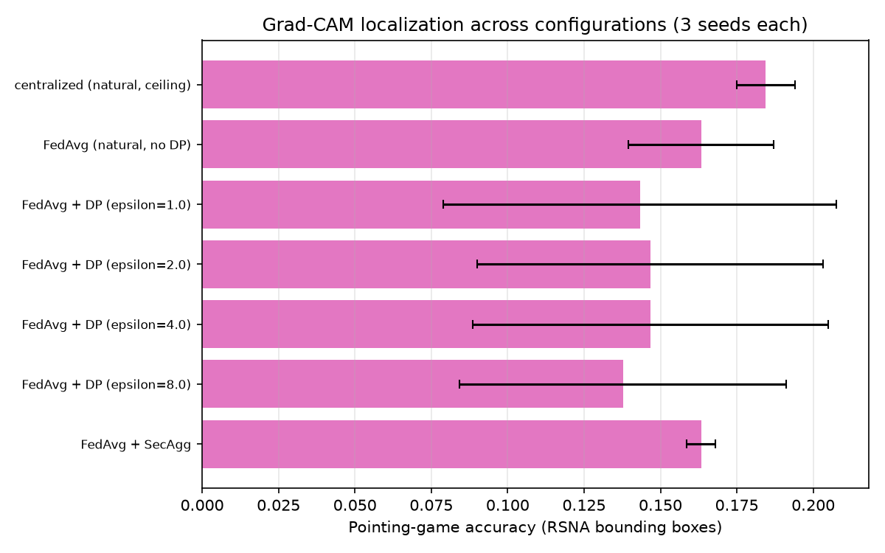
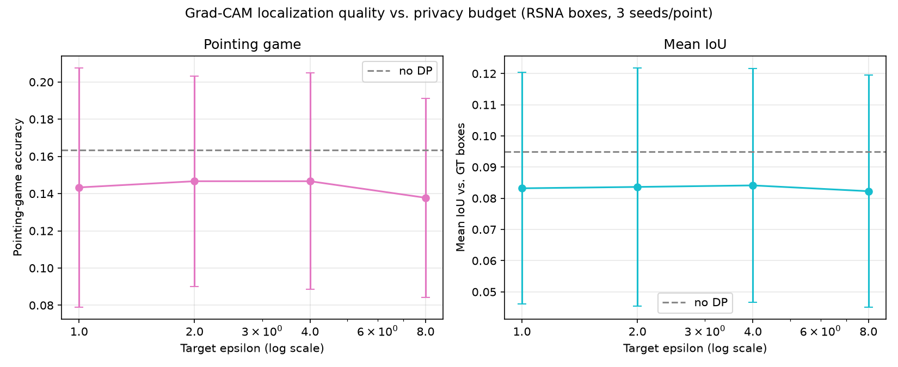

# Quantitative Grad-CAM Evaluation (OPT-3)

CLAUDE.md §15, item 6 states an honest limitation: "Grad-CAM is evaluated
qualitatively." This document measures it quantitatively against RSNA's real
bounding-box annotations — RSNA-only, since Kermany carries no boxes (CLAUDE.md's
own named constraint). Every number below is real, computed from Stage 21's
already-trained checkpoints. Regenerate with:

```bash
uv run python scripts/run_gradcam_evaluation.py
```

Full per-seed and aggregated numbers: `outputs/results/gradcam_localization.json`.

## Method

**Pointing game** (Zhang et al. 2018): does the Grad-CAM heatmap's single
most-activated pixel fall inside a ground-truth bounding box? Reported as the
fraction of images where it does. **Mean IoU**: the heatmap thresholded at 50% of
its own peak value, compared against the union of ground-truth boxes via
intersection-over-union. Both computed on a fixed, seeded subsample of 300 (of
902 eligible) RSNA test-set pneumonia-positive images with real bounding boxes,
identical across every configuration for a fair comparison — see
`src/evaluation/gradcam_eval.py` for the exact formulation and
`scripts/run_gradcam_evaluation.py` for the subsampling procedure.

## Results

Mean ± std over 3 seeds:

| Configuration | Pointing-game accuracy | Mean IoU |
|---|---|---|
| Centralized (natural, ceiling) | 0.1844 ± 0.0096 | 0.0994 ± 0.0074 |
| FedAvg (natural, no DP) | 0.1633 ± 0.0237 | 0.0950 ± 0.0045 |
| FedAvg + SecAgg | 0.1633 ± 0.0047 | 0.0964 ± 0.0022 |
| FedAvg + DP (epsilon=1.0) | 0.1433 ± 0.0643 | 0.0832 ± 0.0371 |
| FedAvg + DP (epsilon=2.0) | 0.1467 ± 0.0566 | 0.0836 ± 0.0382 |
| FedAvg + DP (epsilon=4.0) | 0.1467 ± 0.0582 | 0.0841 ± 0.0375 |
| FedAvg + DP (epsilon=8.0) | 0.1378 ± 0.0535 | 0.0823 ± 0.0372 |



## Reading the results — honestly

**Absolute localization quality is modest across every configuration** —
pointing-game accuracy tops out around 0.18 even for the privacy-free centralized
ceiling. This should be read in context, not as an implementation failure:
pneumonia opacities are frequently diffuse or multi-region on a chest X-ray, and
Grad-CAM's target layer here (`features.norm5`, DenseNet121's final 7×7 feature
map, per CLAUDE.md §9) is spatially coarse before it gets upsampled to 224×224 —
a known, expected source of imprecision for CAM-family methods on this kind of
diffuse medical finding, well documented in the broader Grad-CAM literature, not
specific to this project's implementation.

**Centralized training localizes best**, as expected for the privacy-free,
data-richest configuration, though by a modest margin over FedAvg/SecAgg.

**DP's effect on localization quality is not clearly resolvable from this data**
— every DP epsilon's mean sits slightly below the no-DP/SecAgg configurations,
but the confidence intervals are wide and heavily overlapping:



**The real, honest finding here is about *variance*, not the mean.** Every DP
configuration's std (0.053–0.064) is roughly 3–10x larger than the non-DP
configurations' std (0.005–0.024). Inspecting the per-seed numbers
(`outputs/results/gradcam_localization.json`) shows why: at every epsilon, seed 42
scores substantially lower (pointing-game ≈ 0.05–0.07) than seeds 123 and 2024
(≈ 0.17–0.20) — despite all three seeds achieving comparable *classification*
AUROC and calibration at the same epsilon (`docs/results.md`, `docs/calibration.md`).
This is a genuinely new finding this analysis surfaced: **DP-SGD appears to
destabilize *where* the model's explanation attributes its decision, across
random seeds, even when it does not destabilize classification accuracy at the
same seeds.** A model can be equally accurate under DP while explaining itself
very differently run to run — a clinically relevant trust concern distinct from
either the accuracy cost (`docs/results.md`) or the calibration cost
(`docs/calibration.md`) DP already carries, and one neither of those analyses
would have surfaced on its own.

## Honest summary for the paper

1. Grad-CAM's absolute localization quality on this task is modest even without
   any privacy protection — a property of the task and target-layer resolution,
   not something DP or federation makes meaningfully worse in expectation.
2. No confidently resolvable mean-level DP effect on localization quality — the
   confidence intervals are too wide at this sample size (300 images, 3 seeds) to
   distinguish the DP configurations' means from the non-DP baseline.
3. **DP measurably increases seed-to-seed variance in explanation localization**,
   independent of its effect on accuracy or calibration — a genuine, previously
   unmeasured cost that belongs alongside the accuracy and calibration costs
   already documented, and a concrete argument for reporting Grad-CAM results
   over multiple seeds in this setting rather than a single run.
