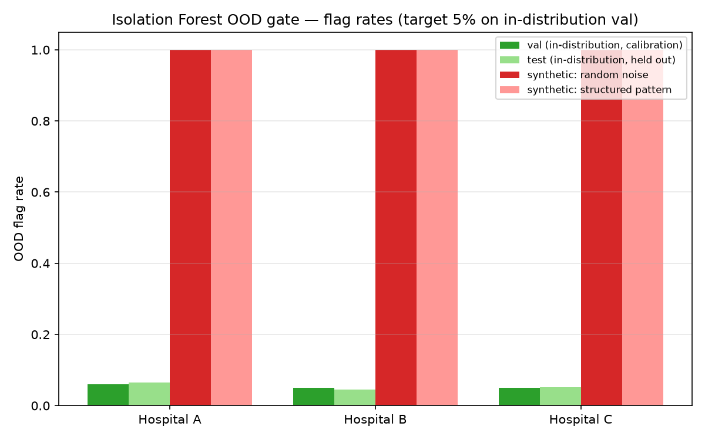

# Isolation Forest OOD Detection Gate (OPT-5)

A client-side safety gate flagging chest X-rays whose frozen-backbone features
are anomalous relative to what a hospital actually trained on — wrong modality,
corrupted scans, an unfamiliar population. This is a different failure mode from
MC Dropout's epistemic uncertainty (Stage 19): MC Dropout implicitly assumes the
input is roughly in-distribution and can be confidently wrong when it isn't; this
gate is the check on that assumption itself. Concept approved 2026-08-29
(CLAUDE.md §16.1a), implemented 2026-08-30. Every number below is real. Regenerate:

```bash
uv run python scripts/build_ood_detector.py
```

Full results: `outputs/results/ood_detector.json`.

## Scope — read before the results

**This does not touch Secure Aggregation or the FedAvg update path, and never
should.** The alternative interpretation — flagging anomalous federated
client/model *updates* rather than anomalous chest X-ray *inputs* — was
considered and explicitly rejected when this extension was first approved in
concept (CLAUDE.md §16.1a): Secure Aggregation's entire purpose is that the
server never sees an individual update, directly opposed to inspecting updates
for anomalies, and malicious-client/Byzantine defense is out of scope for this
project phase (CLAUDE.md §6, §16.2). This module runs entirely client-side, on
already-local cached image features, with zero interaction with any federated
round.

**One Isolation Forest per hospital, not a shared/federated detector** —
Isolation Forest is not a parametric model, so it cannot be `FedAvg`'d; each
hospital trains its own, on its own cached features, consistent with data never
leaving a hospital.

**The 5% flag-rate target is a placeholder, not an owner-approved clinical
policy** — unlike Stage 19's DG-10 (an explicit 10% deferral rate the owner
signed off on), no equivalent decision has been made for this gate yet. `docs/
uncertainty` conventions (the DG-10 fixed-coverage design) are reused for
*how* the threshold is derived, but the specific rate would need the same kind
of explicit clinical sign-off before real deployment.

## Method

For each hospital, one `IsolationForest` (100 trees, seed=42) is trained on that
hospital's full training-set cached features (both classes — training on
Normal-only would make it partially redundant with the classifier itself). The
anomaly-flag threshold is calibrated on the hospital's own held-out validation
set to flag exactly 5% of it (the same fixed-coverage-target design as DG-10's
deferral threshold, `src/uncertainty/deferral.py`) — not a hand-picked raw
Isolation Forest score. Validated three ways: the calibration set itself (by
construction ≈5%), an independent check on the hospital's held-out test set
(never used for calibration), and two kinds of synthetic non-chest-X-ray input
run through the real frozen DenseNet121 backbone (no external natural-image
dataset is available in this project, so uniform random pixel noise and a
structured synthetic pattern of colored geometric shapes stand in — both clearly
unlike a chest X-ray's grayscale anatomy, and both explicitly labeled as
synthetic surrogates, not claimed as real photographs).

## Results

| Hospital | Val flag rate (calibration, target 5%) | Test flag rate (independent, in-distribution) | Random-noise flag rate | Structured-pattern flag rate |
|---|---|---|---|---|
| A | 5.9% | 6.5% | 100.0% | 100.0% |
| B | 5.0% | 4.6% | 100.0% | 100.0% |
| C | 5.0% | 5.2% | 100.0% | 100.0% |



## Reading the results

**The gate generalizes correctly on real, in-distribution data.** Every
hospital's independent test-set flag rate (4.6–6.5%) sits close to its 5%
calibration target, confirming the threshold isn't overfit to the specific
validation examples it was calibrated on.

**Separation from genuine out-of-distribution input is total, not marginal** —
every synthetic OOD image, both kinds, at every hospital, was flagged: 100.0%
across the board, against a ~5% baseline on real chest X-rays. This is a strong,
clean result, not a borderline one: the 1024-dim frozen-backbone feature space
clearly separates "looks like a chest X-ray this hospital has seen the general
shape of before" from "does not," even for inputs (random noise) that share
literally no structure with a chest X-ray.

**Hospital A's slightly elevated flag rate (5.9–6.5% vs. B/C's ~5%)** is
consistent with it having the smallest training set (4,180 vs. 9,330/9,348) —
per the plan's own named risk, a hospital with less local data gets a noisier
detector. The effect here is small (about 1 percentage point above target), not
a failure, but it is reported rather than smoothed over: this is exactly the
kind of per-hospital data-quantity effect this project's honest-limitations
discipline (CLAUDE.md §15) exists to surface rather than hide.

## Honest summary for the paper

1. The gate works, cleanly, at separating genuinely out-of-distribution input
   from real chest X-rays — a strong result, though against a relatively easy
   bar (structurally alien synthetic images, not realistic near-miss cases like
   a different chest X-ray dataset or a mislabeled non-thorax radiograph, which
   would be a harder and more clinically realistic test not attempted here).
2. The false-positive rate on real, unseen in-distribution data tracks its
   calibration target well across all three hospitals, with a small,
   explainable elevation at the smallest hospital.
3. The 5% target flag rate is a reasonable placeholder for demonstrating the
   mechanism, not a clinically validated operating point — real deployment
   would need the same explicit sign-off DG-10 received.
