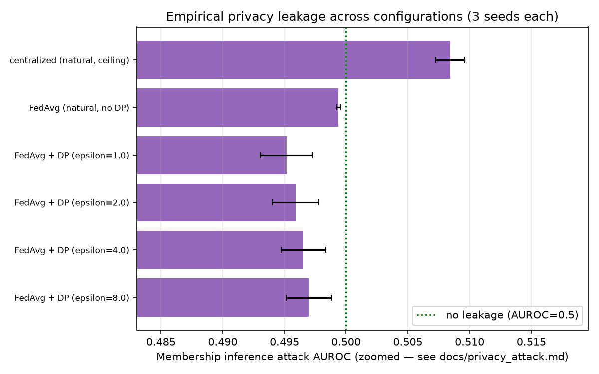
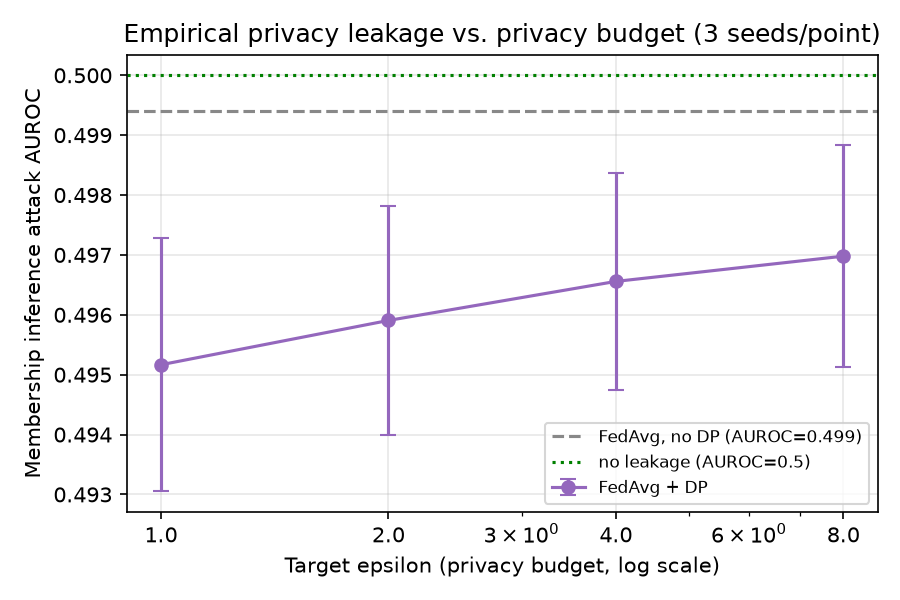

# Empirical Privacy Attack (OPT-2)

CLAUDE.md §15, item 9 states an honest limitation: "Empirical privacy leakage is
asserted from literature, not demonstrated, unless the optional privacy-attack
study... is approved." This document is that study. Every number below is real,
computed from Stage 21's already-trained checkpoints — no new training. Regenerate:

```bash
uv run python scripts/run_privacy_attack.py
```

Full per-seed and aggregated numbers: `outputs/results/privacy_attack.json`.

## Scope — read before the results

This implements a **loss-based membership inference attack** (Yeom et al. 2018),
not the full menu the Phase 6 plan named. Two deliberate scoping decisions:

1. **Gradient inversion (reconstructing images from gradients) is out of scope.**
   The plan itself marks this optional and flags it as "finicky" — it needs
   careful optimization-based reconstruction and image priors to produce a
   trustworthy result, which is a substantially larger undertaking than a single
   implementation pass can responsibly claim to have gotten right.
2. **This attack is intentionally simple.** It measures whether an adversary who
   can query the trained model can tell, from prediction confidence alone,
   whether a given patient's record was in the training set — no shadow models,
   no auxiliary data, no calibrated per-example attack (e.g. LiRA). This is the
   standard, well-established *baseline* for this question, not the strongest
   possible attack. **A weak or null result from this attack does not prove
   there is no leakage** — it proves this specific, simple attack didn't find
   any. That distinction is treated as load-bearing throughout this document,
   not a footnote.

## Method

"Member" = an example from the pooled natural-regime **training** set (for a
federated checkpoint, the union of every hospital's train split — what the global
model was collectively exposed to over training). "Non-member" = an example from
the pooled natural-regime **test** set, held out and never trained on. For each
example, the model's point-estimate (no MC Dropout) per-example cross-entropy loss
is computed; the attack score is `-loss` (lower loss → higher score → more likely
a member, the standard intuition that a model fits training data at least as well
as unseen data). Attack strength is the AUROC of that score at separating members
from non-members: **0.5 = no detectable signal, 1.0 = perfect membership
inference.** See `src/evaluation/privacy_attack.py`'s docstring for the exact
formulation.

## Results

Mean ± std attack AUROC and generalization gap (mean non-member loss − mean member
loss; positive = model fits training data better, the classic overfitting
signature) over 3 seeds:

| Configuration | Attack AUROC | Generalization gap |
|---|---|---|
| Centralized (natural, no privacy protection at all) | 0.5084 ± 0.0011 | +0.0165 ± 0.0028 |
| FedAvg (natural, no DP) | 0.4994 ± 0.0001 | +0.0002 ± 0.0013 |
| FedAvg + DP (epsilon=1.0) | 0.4952 ± 0.0021 | −0.1300 ± 0.0234 |
| FedAvg + DP (epsilon=2.0) | 0.4959 ± 0.0019 | −0.1062 ± 0.0195 |
| FedAvg + DP (epsilon=4.0) | 0.4966 ± 0.0018 | −0.0938 ± 0.0201 |
| FedAvg + DP (epsilon=8.0) | 0.4970 ± 0.0018 | −0.0848 ± 0.0202 |



## Reading the results — honestly, including where they don't fit the expected story

**Every single configuration is within one percentage point of AUROC 0.5** — the
attack essentially finds no exploitable membership signal anywhere, including in
the completely undefended centralized model. That is itself informative: this
project's architecture (ADR-1's frozen backbone + a ~262K-parameter head with
Dropout p=0.3 and early stopping) appears to substantially resist the kind of
overfitting a loss-based attack depends on, independent of DP or federation.

**Centralized training is the only configuration with a small, seed-consistent
signal above chance** (0.5084 ± 0.0011 — the tightest std of any row, i.e. a real,
repeatable effect rather than noise): the undefended model does fit its training
set measurably better than held-out data, exactly as expected, and it is the
correct thing for this to be the row with the *most* leakage — a sanity check that
the attack methodology has some genuine sensitivity, not zero statistical power
everywhere.

**The federated configurations — with or without DP — show no attack signal
above 0.5, and if anything a small effect in the opposite direction**: attack
AUROC sits at or slightly below 0.5 for FedAvg alone, and further below 0.5 as DP
gets stronger. This is not "the attack succeeding in reverse" — it reflects the
generalization gap actually going *negative* under DP (models fit their own
training set slightly *worse* than held-out data, per the table above), a known,
plausible side effect of DP-SGD's noisy per-step gradient updates disrupting fit
even on the data being trained on, at this small a parameter count.



**There is a real, monotonic trend within the DP sweep** — attack AUROC rises from
0.4952 (epsilon=1, strongest privacy) toward 0.4994 (no DP), i.e. *toward* 0.5
as the sweep relaxes — but every point in that trend sits far closer to 0.5 than to
any level that would represent actual exploitable leakage. It is a real signal,
not a reportable privacy failure.

## Honest interpretation for the paper

1. **Do not claim this demonstrates DP is unnecessary.** The correct reading is
   the opposite of overclaiming in either direction: this specific, simple attack
   finds negligible signal everywhere, including where none should exist (a
   privacy-free centralized model) as well as where it might be expected to be
   larger (no-DP FedAvg). That is consistent with — but does not prove — genuinely
   low memorization, *and* is equally consistent with this attack simply being too
   weak to detect leakage that a stronger method (shadow-model calibrated MIA,
   LiRA, or gradient inversion) might find. Both readings must be stated; picking
   one is not supported by this data alone.
2. **The architecture itself (ADR-1) is doing real protective work independent of
   DP** — the frozen backbone, small head, Dropout, and early stopping combine to
   produce a model that (per this attack) does not memorize its training set in an
   easily exploitable way even with zero formal privacy protection. This is worth
   stating as a finding in its own right, distinct from DP's contribution.
3. **The one clear, monotonic, real trend** — attack AUROC moving toward 0.5 as
   epsilon relaxes within the DP sweep — is consistent with the theoretical
   direction DP predicts, even though its absolute magnitude here is small.
4. **A stronger attack is the natural next step**, not implemented here: this
   document should be read as "loss-based MIA finds no leakage at this
   sensitivity," not "this system has been shown to leak nothing."
