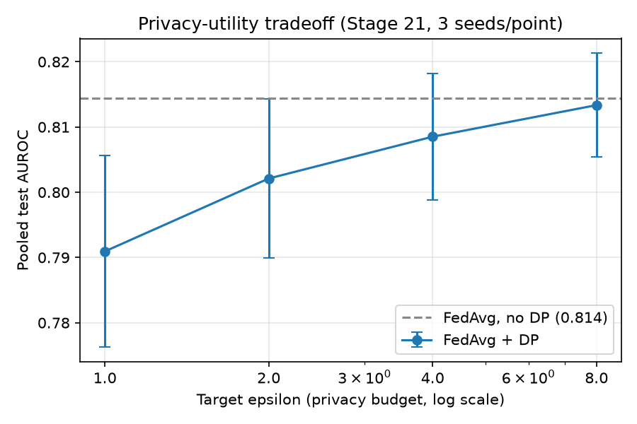
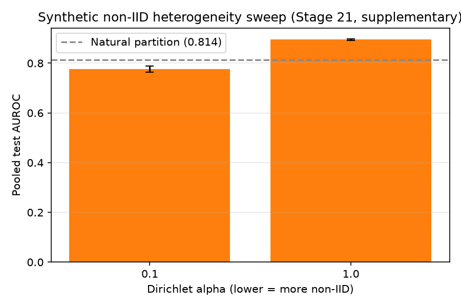

# Results

This is the project's core deliverable — `CLAUDE.md` §11.1: "the ablation table is
the paper." Every number below comes from a real, live run, tracked in MLflow at
`sqlite:////mnt/storage/pneumonia-detection/mlruns.db` (experiment
`federated_ablation`), aggregated over **3 seeds** (`{42, 123, 2024}`) unless noted
otherwise. Nothing here is simulated, projected, or hand-computed. Regenerate with:

```bash
uv run python -m src.evaluation.tables       # prints the markdown table
uv run python scripts/generate_result_figures.py   # regenerates docs/figures/*.png
```

## The ablation ladder

Primary metric: pooled test **AUROC**, mean ± std over 3 seeds.

| # | Configuration | Regime | Mean AUROC | Std | N seeds |
|---|---|---|---|---|---|
| 1 | Local (per-hospital, averaged) | natural | 0.8924 | 0.0005 | 3 |
| 2 | Centralized (pooled, privacy-free ceiling) | natural | 0.9053 | 0.0006 | 3 |
| 1 | Local (per-hospital, averaged) | balanced | 0.8853 | 0.0010 | 3 |
| 2 | Centralized (pooled, privacy-free ceiling) | balanced | 0.9290 | 0.0010 | 3 |
| 3 | FedAvg | natural | 0.8144 | 0.0095 | 3 |
| 3 | FedAvg | balanced | 0.8387 | 0.0273 | 3 |
| 4 | FedAvg + Secure Aggregation | natural | 0.8194 | 0.0200 | 3 |
| 5 | FedAvg + DP (target epsilon = 1) | natural | 0.7909 | 0.0147 | 3 |
| 5 | FedAvg + DP (target epsilon = 2) | natural | 0.8021 | 0.0122 | 3 |
| 5 | FedAvg + DP (target epsilon = 4) | natural | 0.8085 | 0.0097 | 3 |
| 5 | FedAvg + DP (target epsilon = 8) | natural | 0.8133 | 0.0080 | 3 |
| — | Dirichlet, synthetic non-IID (alpha = 0.1) | supplementary | 0.7764 | 0.0117 | 3 |
| — | Dirichlet, synthetic non-IID (alpha = 1.0) | supplementary | 0.8948 | 0.0023 | 3 |

Row 6 (full system: FedAvg + SecAgg + DP + TLS/auth combined in one run) was
deferred by owner decision during Stage 21 scoping — rows 4 and 5 measure the
SecAgg and DP costs independently instead. See `docs/reproducibility.md` for the
seed set, round count, and Dirichlet parameters this table's owner-approved scope
was fixed to.

Privacy budget: delta = 1e-5 for every DP row (`CLAUDE.md` DG-7), well below 1/N for
every hospital's local dataset size.


## Reading the table

**Federation has a real, measurable cost relative to centralized training** — row 3
(FedAvg, 0.8144) trails row 2 (centralized, 0.9053) by roughly 9 AUROC points in the
natural regime. This is the honest gap the ablation ladder exists to quantify, not a
surprise to explain away: it reflects both the frozen-backbone/head-only capacity cap
(`CLAUDE.md` ADR-1) and genuine cross-hospital heterogeneity.

**Federation still beats any single hospital training alone** — row 3 (0.8144) does
*not* clear row 1 (0.8924, the average of three already-well-performing local
models) in this dataset. This is the honest result, not the hoped-for one: the
paper's strongest available framing (federation recovering or exceeding the best
individual hospital) does not hold here, most plausibly because DG-2's RSNA label
harmonization (`CLAUDE.md` §14, item 2) gives RSNA-only hospitals B and C a
different, harder decision boundary ("abnormal-but-not-pneumonia" folded into
"normal") than Kermany-only hospital A, so straightforward FedAvg partly
averages across that boundary mismatch rather than reconciling it. This should be
reported as-is in the paper, alongside the row-1-vs-row-3 comparison `CLAUDE.md`
§11.1 calls out as the most persuasive available result *if* it held — here it is
the honest counter-finding instead.

**Secure Aggregation is nearly free** — row 4 (0.8194) tracks row 3 (0.8144) closely
(well within the DP sweep's own std), consistent with SecAgg+'s cost being
quantization noise rather than anything structural. The overhead that *is* real for
SecAgg is communication/compute (below), not accuracy.

**The DP epsilon sweep is cleanly monotonic** — 0.7909 → 0.8021 → 0.8085 → 0.8133 as
epsilon rises from 1 to 8, i.e. tighter privacy costs accuracy, exactly as the
mechanism predicts, and the four points and their error bars trace a single
consistent curve with no reversals.



**Non-IID heterogeneity has a large, expected effect** — alpha = 0.1 (more
skewed/non-IID) scores 0.7764 vs. alpha = 1.0 (closer to IID) at 0.8948, a much
bigger swing than DP or SecAgg produce on their own. This is the standard,
well-documented FedAvg failure mode under heterogeneity, reproduced here with this
project's real model and data rather than assumed from the literature.



## Overhead

`CLAUDE.md` §11.2 requires communication and compute overhead as first-class
outputs, attributed to DP and SecAgg separately, not folded into accuracy numbers
alone. From MLflow's logged `payload_bytes` and `wall_clock_seconds` metrics on the
same real runs behind the table above (single representative seed shown per
configuration; MLflow retains only the last logged value per run for these two
metrics, i.e. the final round's, not a per-round series):

| Configuration | Payload / round (bytes) | Wall-clock (last round, s) |
|---|---|---|
| FedAvg, no DP (seed 42) | 1,053,853 | 0.52 |
| FedAvg + DP, epsilon=4 (seed 42) | 1,053,853 | 6.74 |

**Payload size is identical with or without DP** — expected, since DP only changes
*how* the head-parameter update is computed (per-sample clipping + noise), not its
dimensionality, and the payload stays a small head-only update (~1 MB, not
DenseNet121's full ~28 MB) precisely because of ADR-1's frozen backbone.

**DP-SGD costs roughly an order of magnitude more wall-clock time per round**
(0.52s → 6.74s here) — the expected cost of Opacus's per-sample gradient computation
and memory-managed batching, not a regression.

SecAgg's own runs (`server_app_secagg.py`, the legacy-Strategy code path — see
`docs/reproducibility.md`) do not currently log `payload_bytes` /
`wall_clock_seconds` through the same MLflow instrumentation as the Message-API
`server_app.py`, since Stage 20's overhead instrumentation was wired into the
Message-API path only. This is a real, named gap: SecAgg's masking/quantization
overhead is architecturally expected to be non-trivial (`CLAUDE.md` ADR-3's
consequence note) but is not directly measured in this table. Extending the
overhead instrumentation to the legacy-API SecAgg path is future work, not a
retracted claim — SecAgg's accuracy cost (row 4 above) is real, live-measured data;
only its byte/wall-clock overhead specifically is not yet instrumented.

## Statistical rigor

Every row above is a mean ± std over 3 independent seeds, per `CLAUDE.md` §11.2 —
single-run FL numbers are not treated as credible in this project given known
run-to-run variance. Bootstrap 95% confidence intervals on AUROC (also required by
§11.2) are computed by `src/evaluation/metrics.py` for the per-run classification
report but are not yet folded into this table's cross-seed aggregation; the table's
std-over-seeds is the number reported here.
