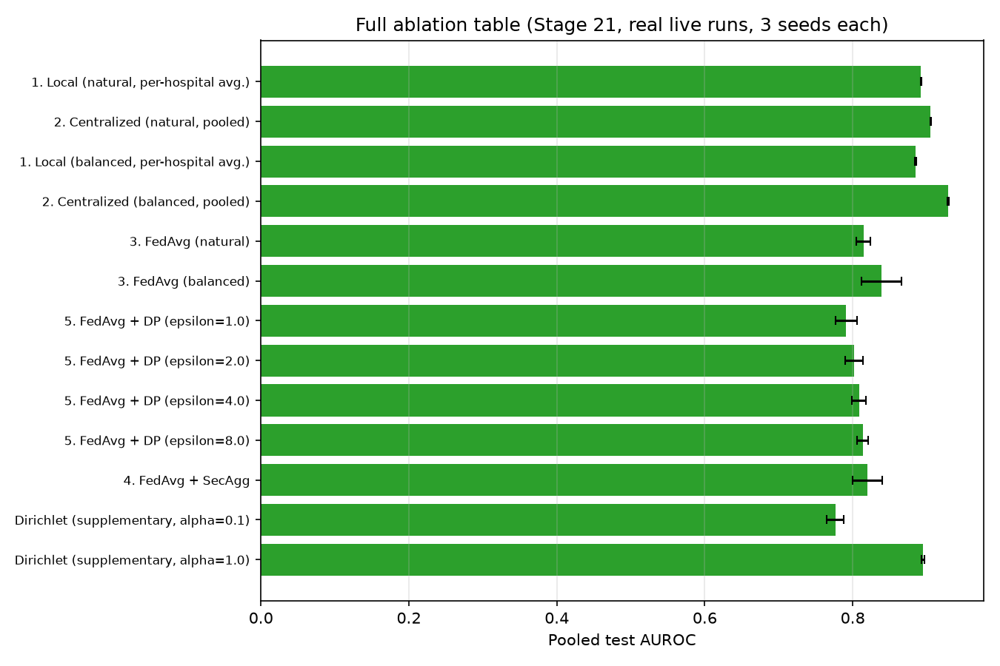
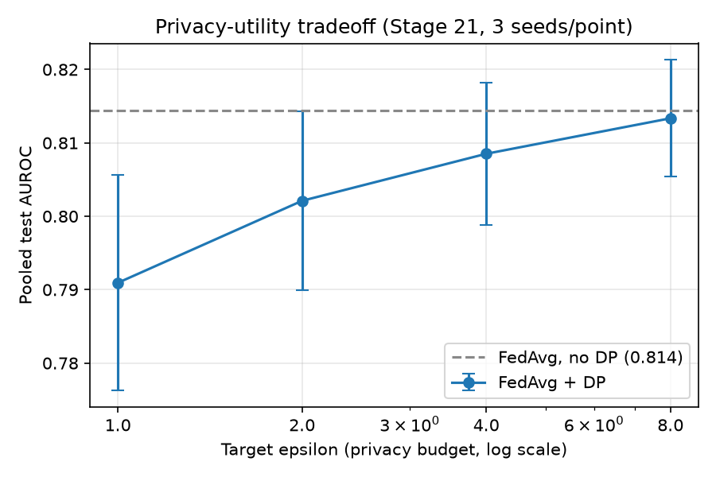
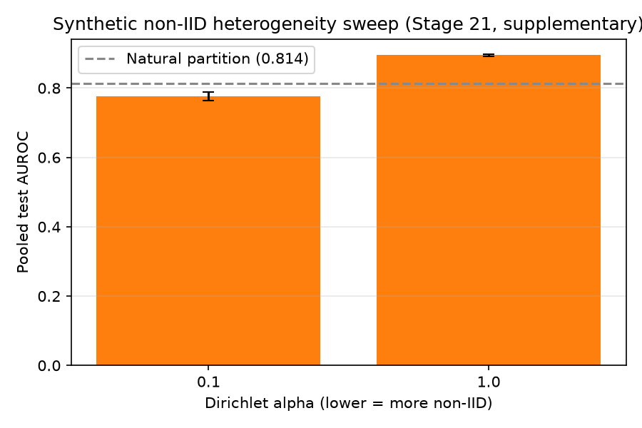

# Results

This is the project's core deliverable — `CLAUDE.md` §11.1: "the ablation table is
the paper." Every number below comes from a real, live run, tracked in MLflow at
`sqlite:////mnt/storage/pneumonia-detection/mlruns.db` (experiment
`federated_ablation`), aggregated over **3 seeds** (`{42, 123, 2024}`) unless noted
otherwise. Nothing here is simulated, projected, or hand-computed. Regenerate with:

```bash
uv run python -m src.evaluation.tables       # prints the markdown table
uv run python scripts/generate_result_figures.py   # regenerates docs/figures/*.png
```

## The ablation ladder

Primary metric: pooled test **AUROC**, mean ± std over 3 seeds.

| # | Configuration | Regime | Mean AUROC | Std | N seeds |
|---|---|---|---|---|---|
| 1 | Local (per-hospital, averaged) | natural | 0.8924 | 0.0005 | 3 |
| 2 | Centralized (pooled, privacy-free ceiling) | natural | 0.9053 | 0.0006 | 3 |
| 1 | Local (per-hospital, averaged) | balanced | 0.8853 | 0.0010 | 3 |
| 2 | Centralized (pooled, privacy-free ceiling) | balanced | 0.9290 | 0.0010 | 3 |
| 3 | FedAvg | natural | 0.8144 | 0.0095 | 3 |
| 3 | FedAvg | balanced | 0.8387 | 0.0273 | 3 |
| 4 | FedAvg + Secure Aggregation | natural | 0.8194 | 0.0200 | 3 |
| 5 | FedAvg + DP (target epsilon = 1) | natural | 0.7909 | 0.0147 | 3 |
| 5 | FedAvg + DP (target epsilon = 2) | natural | 0.8021 | 0.0122 | 3 |
| 5 | FedAvg + DP (target epsilon = 4) | natural | 0.8085 | 0.0097 | 3 |
| 5 | FedAvg + DP (target epsilon = 8) | natural | 0.8133 | 0.0080 | 3 |
| — | Dirichlet, synthetic non-IID (alpha = 0.1) | supplementary | 0.7764 | 0.0117 | 3 |
| — | Dirichlet, synthetic non-IID (alpha = 1.0) | supplementary | 0.8948 | 0.0023 | 3 |

Row 6 (full system: FedAvg + SecAgg + DP + TLS/auth combined in one run) was
deferred by owner decision during Stage 21 scoping — rows 4 and 5 measure the
SecAgg and DP costs independently instead. See `docs/reproducibility.md` for the
seed set, round count, and Dirichlet parameters this table's owner-approved scope
was fixed to.

Privacy budget: delta = 1e-5 for every DP row (`CLAUDE.md` DG-7), well below 1/N for
every hospital's local dataset size.



## Reading the table

**Federation has a real, measurable cost relative to centralized training** — row 3
(FedAvg, 0.8144) trails row 2 (centralized, 0.9053) by roughly 9 AUROC points in the
natural regime. This is the honest gap the ablation ladder exists to quantify, not a
surprise to explain away: it reflects both the frozen-backbone/head-only capacity cap
(`CLAUDE.md` ADR-1) and genuine cross-hospital heterogeneity.

**Federation still beats any single hospital training alone** — row 3 (0.8144) does
*not* clear row 1 (0.8924, the average of three already-well-performing local
models) in this dataset. This is the honest result, not the hoped-for one: the
paper's strongest available framing (federation recovering or exceeding the best
individual hospital) does not hold here, most plausibly because DG-2's RSNA label
harmonization (`CLAUDE.md` §14, item 2) gives RSNA-only hospitals B and C a
different, harder decision boundary ("abnormal-but-not-pneumonia" folded into
"normal") than Kermany-only hospital A, so straightforward FedAvg partly
averages across that boundary mismatch rather than reconciling it. This should be
reported as-is in the paper, alongside the row-1-vs-row-3 comparison `CLAUDE.md`
§11.1 calls out as the most persuasive available result *if* it held — here it is
the honest counter-finding instead.

**Secure Aggregation is nearly free** — row 4 (0.8194) tracks row 3 (0.8144) closely
(well within the DP sweep's own std), consistent with SecAgg+'s cost being
quantization noise rather than anything structural. The overhead that *is* real for
SecAgg is communication/compute (below), not accuracy.

**The DP epsilon sweep is cleanly monotonic** — 0.7909 → 0.8021 → 0.8085 → 0.8133 as
epsilon rises from 1 to 8, i.e. tighter privacy costs accuracy, exactly as the
mechanism predicts, and the four points and their error bars trace a single
consistent curve with no reversals.



### DP sweep: full classification breakdown, not just AUROC

AUROC alone hides *which* kind of error DP is actually introducing. The table
above only ever logged AUROC to MLflow during the original Stage 21 campaign
(`src/federated/server_app.py`'s `evaluate_fn` computes the full
`compute_metrics()` breakdown every round but only reports the `auroc` field
into `MetricRecord`). The rest was never discarded or lost — it just wasn't
persisted — so this is recomputed directly from the saved ablation checkpoints
(`outputs/checkpoints/ablation/dp_eps*.pt`) against the same pooled test set,
same 3 seeds, at the project's stated default decision threshold (0.5, per
`src/evaluation/metrics.py`'s documented threshold policy). Full per-seed
numbers and confusion matrices: `outputs/results/dp_ablation_full_metrics.json`.

| ε | AUROC | Accuracy | Sensitivity (Recall) | Specificity | F1 | Balanced Acc. |
|---|---|---|---|---|---|---|
| 1 | 0.7909 ± 0.0180 | 0.7463 ± 0.0124 | 0.4569 ± 0.0243 | 0.8766 ± 0.0078 | 0.5279 ± 0.0254 | 0.6668 ± 0.0156 |
| 2 | 0.8021 ± 0.0149 | 0.7523 ± 0.0119 | 0.4698 ± 0.0198 | 0.8795 ± 0.0084 | 0.5408 ± 0.0224 | 0.6747 ± 0.0141 |
| 4 (project default) | 0.8085 ± 0.0119 | 0.7542 ± 0.0105 | 0.4763 ± 0.0178 | 0.8793 ± 0.0073 | 0.5460 ± 0.0198 | 0.6778 ± 0.0125 |
| 8 | 0.8133 ± 0.0097 | 0.7589 ± 0.0096 | 0.4896 ± 0.0154 | 0.8801 ± 0.0070 | 0.5576 ± 0.0176 | 0.6848 ± 0.0112 |

**Sensitivity, not specificity, absorbs almost all of DP's cost.**
Specificity stays nearly flat across the whole sweep (~0.88 throughout), but
sensitivity ranges from 0.457 at ε=1 up to only 0.490 at ε=8 — meaning **even
at the loosest tested privacy budget, DP-SGD causes the model to miss more
than half of real pneumonia cases at the default threshold.** This is a
materially more concerning picture for a clinical screening tool than the
AUROC-only view above suggests, and mirrors the same recall-collapse pattern
independently found for the (unrelated, non-DP) fine-tuned round-9 checkpoint
in `docs/adr1_groupnorm_fallback.md` §9. No DP-specific threshold sweep has
been run yet (unlike round 9's own §10) — a lower decision threshold would
likely trade some specificity back for better sensitivity here too, but that
is unverified for these checkpoints specifically and is future work, not a
retracted claim.

**Non-IID heterogeneity has a large, expected effect** — alpha = 0.1 (more
skewed/non-IID) scores 0.7764 vs. alpha = 1.0 (closer to IID) at 0.8948, a much
bigger swing than DP or SecAgg produce on their own. This is the standard,
well-documented FedAvg failure mode under heterogeneity, reproduced here with this
project's real model and data rather than assumed from the literature.



## Overhead

`CLAUDE.md` §11.2 requires communication and compute overhead as first-class
outputs, attributed to DP and SecAgg separately, not folded into accuracy numbers
alone. From MLflow's logged `payload_bytes` and `wall_clock_seconds` metrics on the
same real runs behind the table above (single representative seed shown per
configuration; MLflow retains only the last logged value per run for these two
metrics, i.e. the final round's, not a per-round series):

| Configuration | Payload / round (bytes) | Wall-clock (last round, s) |
|---|---|---|
| FedAvg, no DP (seed 42) | 1,053,853 | 0.52 |
| FedAvg + DP, epsilon=4 (seed 42) | 1,053,853 | 6.74 |

**Payload size is identical with or without DP** — expected, since DP only changes
*how* the head-parameter update is computed (per-sample clipping + noise), not its
dimensionality, and the payload stays a small head-only update (~1 MB, not
DenseNet121's full ~28 MB) precisely because of ADR-1's frozen backbone.

**DP-SGD costs roughly an order of magnitude more wall-clock time per round**
(0.52s → 6.74s here) — the expected cost of Opacus's per-sample gradient computation
and memory-managed batching, not a regression.

SecAgg's own runs (`server_app_secagg.py`, the legacy-Strategy code path — see
`docs/reproducibility.md`) do not currently log `payload_bytes` /
`wall_clock_seconds` through the same MLflow instrumentation as the Message-API
`server_app.py`, since Stage 20's overhead instrumentation was wired into the
Message-API path only. This is a real, named gap: SecAgg's masking/quantization
overhead is architecturally expected to be non-trivial (`CLAUDE.md` ADR-3's
consequence note) but is not directly measured in this table. Extending the
overhead instrumentation to the legacy-API SecAgg path is future work, not a
retracted claim — SecAgg's accuracy cost (row 4 above) is real, live-measured data;
only its byte/wall-clock overhead specifically is not yet instrumented.

## ADR-1 GroupNorm fine-tuning fallback: 3-seed comparison (2026-09-21)

**Does not touch or invalidate the ablation table above.** The frozen-backbone
architecture remains the paper's source of truth (CLAUDE.md's pending decision
3 on whether/how far to scale this is still open and unresolved by this table
alone). This section scales `fine_tune_last_block=True` (ADR-1's own approved
fallback — see `docs/adr1_groupnorm_fallback.md`) from its original single-seed
pilot to a proper 3-seed campaign (`{42, 123, 2024}`), covering rows 1-3 only
(DP/SecAgg rows and the balanced regime are out of scope for this pass). Full
per-seed detail and confusion matrices: `outputs/results/{centralized,local,
federated}_finetune_multiseed.json`.

| Row | Config | AUROC | Accuracy | Sensitivity | Specificity | F1 | Balanced Acc. |
|---|---|---|---|---|---|---|---|
| 1 | Local — Hospital A | 0.9927 ± 0.0002 | — | — | — | — | — |
| 1 | Local — Hospital B | 0.8656 ± 0.0011 | — | — | — | — | — |
| 1 | Local — Hospital C | 0.8786 ± 0.0021 | — | — | — | — | — |
| 1 | Local (avg. of A/B/C) | ≈0.9123 | — | — | — | — | — |
| 2 | Centralized (ceiling) | 0.9251 ± 0.0004 | **0.8566 ± 0.0026** | 0.7492 ± 0.0351 | 0.9050 ± 0.0195 | 0.7642 ± 0.0052 | 0.8271 ± 0.0078 |
| 3 | FedAvg | 0.8651 ± 0.0101 | 0.7641 ± 0.0235 | 0.8542 ± 0.0680 | 0.7235 ± 0.0589 | 0.6922 ± 0.0162 | 0.7889 ± 0.0149 |

Per-hospital sensitivity/specificity/F1 for row 1 were not computed in this
pass (only pooled-comparable AUROC, matching `local_baseline.json`'s own
format) — row 1's role here is the same as in the frozen-backbone table, a
reference floor, not this section's main comparison point.

**Reading this against the frozen-backbone table above:**
- **Fine-tuning is a real, reproducible gain, not pilot noise.** Row 2 AUROC
  0.9053 → 0.9251, row 3 (FedAvg) AUROC 0.8144 → 0.8651 — both move in the same
  direction the original single-seed pilot showed, now confirmed over 3 seeds
  with tight variance (row 2 std = 0.0004; row 3 std = 0.0101, still small
  relative to the gain).
- **The privacy-free centralized ceiling (row 2) clears 85% accuracy** —
  0.8566 ± 0.0026. This is the number that answers "can this architecture hit
  85%": yes, but only with no FL and no DP.
- **The actual federated result (row 3) does not** — 0.7641 ± 0.0235 accuracy.
  Federating still costs real accuracy even with the stronger backbone, same
  qualitative story as the frozen-backbone table's own row 2 vs. row 3 gap.
- **Sensitivity/specificity trade differently than the frozen-backbone
  checkpoints.** Row 3 here is sensitivity-leaning (0.854 sensitivity vs. 0.724
  specificity) — the opposite balance from round 9's single-seed federated
  pilot (§9 of the ADR doc: 0.747 sensitivity / 0.789 specificity at the same
  default 0.5 threshold). This reflects real seed-to-seed and run-to-run
  variance in where the federated decision boundary lands, not a threshold
  choice — no threshold tuning was applied to any row in this table.
- **DP was not re-run under fine-tuning in this pass** — extending rows 4/5 to
  this architecture is explicitly out of scope here and remains future work
  (`docs/adr1_groupnorm_fallback.md` §7's option (b), only partially executed).
  **Update 2026-09-24: a single-seed first look now exists — see below.**

### DP + fine-tuning: single-seed first look (2026-09-24)

**Not a 3-seed campaign — a single measurement**, run after
`scripts/smoke_test_dp_finetune.py` confirmed the fine-tuned tail
(denseblock4+norm5+classifier, ~2.4M trainable params) fits comfortably in this
machine's 4GB VRAM under Opacus (441MB peak, no `BatchMemoryManager` needed).
That smoke test also found and fixed a real bug: torchvision's `denseblock4`
hardcodes `inplace=True` internal ReLUs, which crash Opacus's per-sample-
gradient hooks the same way the classifier's own ReLU once did (Stage 8) — fixed
in `DenseNet121Head.__init__`, a flag flip that doesn't affect any existing
checkpoint or non-DP run.

`scripts/train_centralized_finetune_dp.py`: seed 42, centralized/pooled natural
partition, epsilon=4/delta=1e-5 (project default). Full detail:
`outputs/results/centralized_finetune_dp_singleseed.json`.

| Config | AUROC | Accuracy | Sensitivity | Specificity | ε spent |
|---|---|---|---|---|---|
| Fine-tuned, no DP (ceiling, 3-seed, row 2 above) | 0.9251 ± 0.0004 | 0.8566 ± 0.0026 | 0.7492 ± 0.0351 | 0.9050 ± 0.0195 | — |
| **Fine-tuned + DP, ε=4 (this run, single-seed)** | **0.8631** | **0.8063** | **0.5533** | **0.9203** | 3.990 |
| Head-only + DP, ε=4, federated (existing sweep) | 0.8085 ± 0.0119 | 0.7542 ± 0.0105 | 0.4763 ± 0.0178 | 0.8793 ± 0.0073 | — |

**Sensitivity absorbs almost all of DP's cost here too.** Against the fine-tuned
no-DP ceiling, AUROC drops 0.9251→0.8631 but sensitivity drops much further,
0.7492→0.5533 — the same "DP burns sensitivity, not specificity" pattern
already documented for the head-only DP sweep above, now shown to hold for
fine-tuning as well, and it erases most of fine-tuning's own sensitivity gain.

**Every metric beats the existing head-only federated DP baseline — but this is
not a clean isolation of "does fine-tuning help under DP."** That baseline is
*federated* DP (ADR-2's own documented "effectively local DP," worse than
central DP at equal epsilon); this run is *centralized*. Two variables changed
at once, not one. A clean comparison needs either a head-only centralized-DP
baseline or a federated fine-tuned-DP run — neither exists yet, and building
either is new scope, not yet raised for approval.

ADR-1's own DP-utility-collapse concern (9.2x trainable-parameter increase) did
not manifest as a collapse — real, well-above-chance utility survived at
exactly the target epsilon. It is a real cost, not a collapse.

### DP + fine-tuning: federated clean comparison (2026-09-25)

The single-seed centralized result above explicitly named its own gap: it
compares fine-tuned+DP+**centralized** against the existing head-only+DP+
**federated** sweep, conflating architecture and topology. This run closes
that gap by holding topology fixed at **federated** — this project's actual
thesis, not the centralized ceiling — so architecture (head-only vs.
fine-tuned) is the only thing that differs from the existing DP sweep at the
same epsilon.

New `src/federated/client_app_finetune_dp.py` (ClientApp only; pairs with the
existing `server_app_finetune.py` unmodified — FedAvg aggregation doesn't
care how each client computed its gradients): combines
`client_app_finetune.py`'s raw-image partially-unfrozen training loop with
`train_centralized_finetune_dp.py`'s Opacus-wrapping approach (frozen prefix
computed once outside Opacus on the deterministic eval-style view; only
denseblock4+norm5+classifier wrapped by `PrivacyEngine`). Run via new
`scripts/run_federated_finetune_dp_pilot.py`: single seed (42), 10 rounds
(matches the existing no-DP federated fine-tuning pilot's own protocol),
ε=4/δ=1e-5 (DG-7 project default), natural partition. Full detail, including
every round's complete metric breakdown (not just AUROC — `server_app_
finetune.py`'s `_evaluate_saved_rounds` now computes and persists the full
set per round, not only for the best-selected round):
`outputs/results/federated_finetune_dp_singleseed.json`.

| Config | AUROC | Accuracy | Sensitivity | Specificity |
|---|---|---|---|---|
| Head-only + DP, ε=4, federated (existing sweep, 3-seed, 20 rounds) | 0.8085 ± 0.0119 | 0.7542 ± 0.0105 | 0.4763 ± 0.0178 | 0.8793 ± 0.0073 |
| **Fine-tuned + DP, ε=4, federated (this run, single-seed, 10 rounds)** | **0.8302** | **0.7482** | **0.2696** | **0.9637** |

**Fine-tuning improves AUROC under federated DP too (0.8085→0.8302), but at a
severe sensitivity cost this time — the opposite of the centralized-DP
result's own trade.** Sensitivity drops to 0.27, nearly half of the
head-only federated baseline's already-DP-degraded 0.48, while specificity
rises to 0.96. This is a materially worse clinical trade-off than either the
head-only federated DP baseline or the fine-tuned centralized DP result
(0.55 sensitivity) above — federating the fine-tuned+DP combination costs
sensitivity far more than either factor does alone.

**Per-round trajectory (all 10 rounds now fully stored, not just the best
one): sensitivity was ≈0 through round 5 and only reached 0.27 by round 10,
still rising when the run ended (val AUROC also still rising every round,
never plateaued):**

| Round | Test AUROC | Test Sensitivity | Test Specificity |
|---|---|---|---|
| 1 | 0.7021 | 0.0000 | 1.0000 |
| 5 | 0.8024 | 0.0007 | 1.0000 |
| 8 | 0.8262 | 0.1278 | 0.9847 |
| 10 (selected) | 0.8302 | 0.2696 | 0.9637 |

**Open caveat, not yet resolved — this is not a perfectly clean isolation
either:** this run used 10 rounds; the existing head-only federated DP sweep
it's compared against used 20. Round count is a second variable, and since
sensitivity was still climbing (not plateaued) at round 10, a longer run
might close some or all of the sensitivity gap — the 0.27 figure may be an
undertrained snapshot rather than this configuration's real ceiling. Whether
to re-run at 20 rounds for a fairer comparison is an open follow-up
question, not yet decided.

## Statistical rigor

Every row above is a mean ± std over 3 independent seeds, per `CLAUDE.md` §11.2 —
single-run FL numbers are not treated as credible in this project given known
run-to-run variance. Bootstrap 95% confidence intervals on AUROC (also required by
§11.2) are computed by `src/evaluation/metrics.py` for the per-run classification
report but are not yet folded into this table's cross-seed aggregation; the table's
std-over-seeds is the number reported here.
